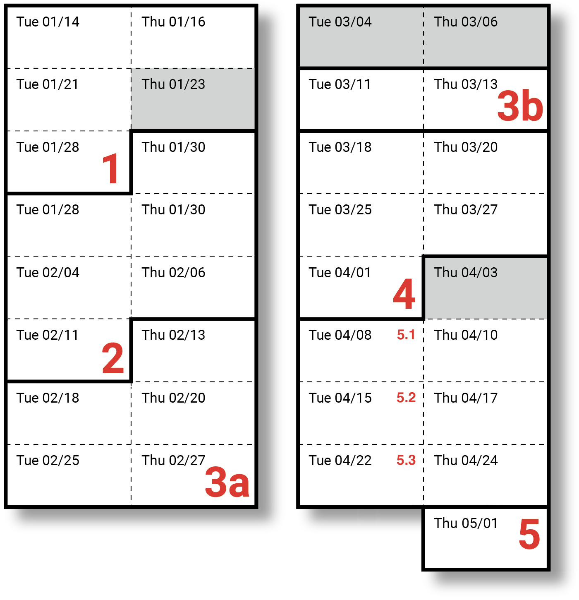

# gen-ai

**Art and Generative AI, Spring 2025** (60-228) 
Prof. Golan Levin, CMU School of Art

---

## Key Links

* The Syllabus can be found [here](https://github.com/golanlevin/gen-ai/blob/main/syllabus/readme.md)

## Daily Notes

* `Tue 01/14` [Hello](daily_notes/0114.md)
* `Thu 01/16` [Hello II](daily_notes/0116.md)
* `Tue 01/21` [The Reimagined Body](daily_notes/0121.md)
* `Thu 01/23` *No session, Golan away*
* `Tue 01/28` [Intro to Stable Diffusion](daily_notes/0128.md)
* `Thu 01/30` [Intro to ComfyUI](daily_notes/0130.md)
* `Tue 02/04` [ComfyUI II: LoRA](daily_notes/0204.md)
* `Thu 02/06` [ComfyUI Worksession](daily_notes/0206.md)
* `Tue 02/11` [Sam Lavigne visit](daily_notes/0211.md)
* `Thu 02/13` [Project Presentations Continued; intro to Unit 3](daily_notes/0213.md)
* `Tue 02/18` [Capture Machines, Datasets](daily_notes/0218.md)
* `Thu 02/20` [Capture Machines, Ffmpeg, BSoup](daily_notes/0220.md)
* `Tue 02/25` [UMAP/t-SNE](daily_notes/0225.md)
* `Thu 02/27` [LoRA](daily_notes/0227.md)

---

## Assignments and Due Dates

* `Tue 01/14`: --
* `Thu 01/16`: Due: [1.1](https://github.com/golanlevin/gen-ai/blob/main/assignments/assignment_1.md#11-administrative-tasks), [1.2](https://github.com/golanlevin/gen-ai/blob/main/assignments/assignment_1.md#12-report-an-ai-art-you-like), [1.3](https://github.com/golanlevin/gen-ai/blob/main/assignments/assignment_1.md#13-looking-outwards-algorithms-models-tools), [1.4](https://github.com/golanlevin/gen-ai/blob/main/assignments/assignment_1.md#14-viewing---response)
* `Tue 01/21`: Due: [1.5](https://github.com/golanlevin/gen-ai/blob/main/assignments/assignment_1.md#15-wrong-things), [1.6](https://github.com/golanlevin/gen-ai/blob/main/assignments/assignment_1.md#16-puppet-conditioning)
* `Thu 01/23`: *Work session (Golan away)*. 
* `Tue 01/28`: Due: [1.7](https://github.com/golanlevin/gen-ai/blob/main/assignments/assignment_1.md#17-dreamworld-self-portrait)
* `Thu 01/30`: Due: [2.1](https://github.com/golanlevin/gen-ai/blob/main/assignments/assignment_2.md#21-technical-overview-of-stable-diffusion), [2.2](https://github.com/golanlevin/gen-ai/blob/main/assignments/assignment_2.md#22-comfyui-ecosystem-exploration) 
* `FEB -----`
* `Tue 02/04`: Due: [2.3](https://github.com/golanlevin/gen-ai/blob/main/assignments/assignment_2.md#23-readings), [2.4](https://github.com/golanlevin/gen-ai/blob/main/assignments/assignment_2.md#24-helpful-viewings), [2.5](https://github.com/golanlevin/gen-ai/blob/main/assignments/assignment_2.md#25-image-analysis-with-comfy), [2.6](https://github.com/golanlevin/gen-ai/blob/main/assignments/assignment_2.md#26-style-transfer--upscaling-in-comfy)
* `Thu 02/06`: *Work session.*
* `Tue 02/11`: [**Assignment 2.7 (System)**](https://github.com/golanlevin/gen-ai/blob/main/assignments/assignment_2.md#27-a-generative-system-in-comfy-6-hours-due-211) Due. Sam Lavigne class visit (8:00pm). 
* `Thu 02/13`: 
* `Tue 02/18`: Due [3.0-3.3](assignments/assignment_3.md)
* `Thu 02/20`: 
* `Tue 02/25`: Due [3.4](https://github.com/golanlevin/gen-ai/blob/main/assignments/assignment_3.md#34-draft-collection-500-images)
* `Thu 02/27`: Due [3.5](https://github.com/golanlevin/gen-ai/blob/main/assignments/assignment_3.md#35-umapt-sne-mosaic) (UMAP/t-SNE mosaic)
* `MAR -----`
* `Tue 03/04`: *No session (Spring Break)*
* `Thu 03/06`: *No session (Spring Break)*
* `Tue 03/11`: 
* `Thu 03/13`: Assignments #3b Due.
* `Tue 03/18`: 
* `Thu 03/20`: 
* `Tue 03/25`: 
* `Thu 03/27`: 
* `APR -----`
* `Tue 04/01`: Assignments #4 Due. Kyle McDonald class visit.
* `Thu 04/03`: *No session (Spring Carnival)*
* `Tue 04/08`: 
* `Tue 04/10`: 
* `Tue 04/15`: 
* `Tue 04/17`: 
* `Tue 04/22`: 
* `Tue 04/24`: Assignments #5 Draft Due. 
* `---------`
* *On or prior to 05/05: Final Project Presentations.*

