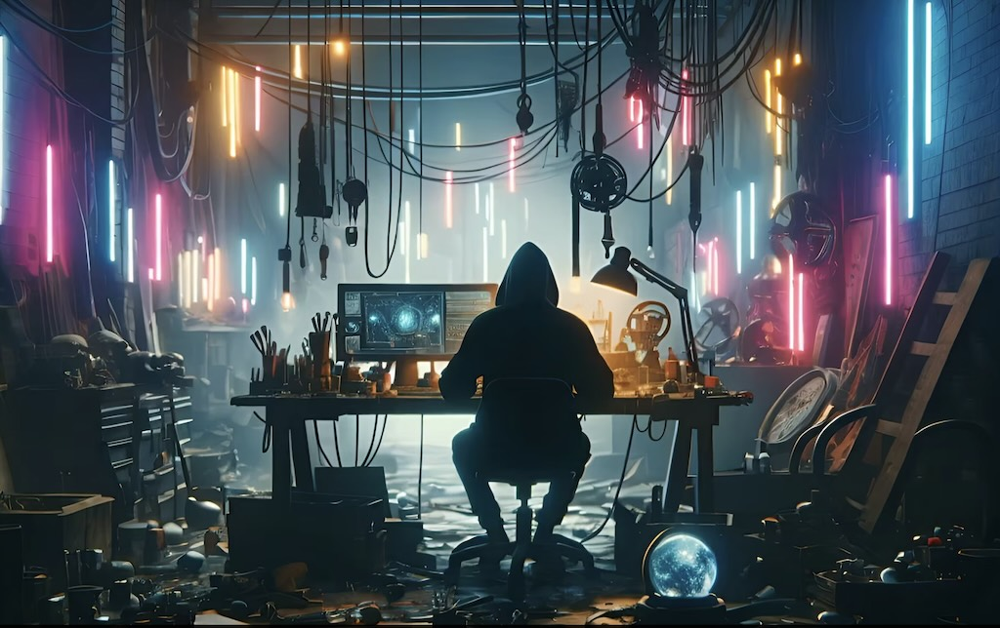
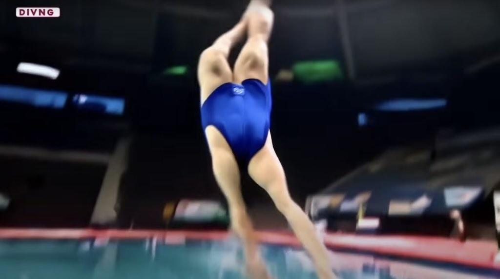
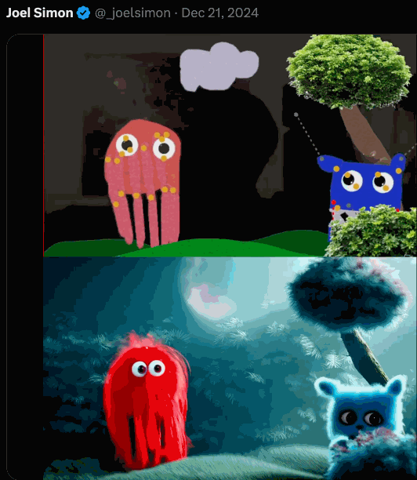
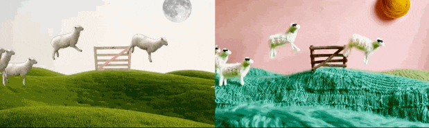

# Assignment Set #1: Introduction

This Assignment has seven components, due on various days before the end of January: 

* **1.1. Administrative Tasks** — *30 minutes • 10% • Due 1/16*
* **1.2. Report: An AI Art You Like** — *15 minutes • 10% • Due Thursday 1/16*
* **1.3. Looking Outwards (Tools)** — *15 minutes • 10% • Due Thursday 1/16*
* **1.4. Viewing-Response** — *30 minutes • 10% • Due Thursday 1/16*
* **1.5. Wrong Things** — *2 hours • 10% • Due Tuesday 1/21*
* **1.6. Puppet Conditioning** — *3 hours • 20% • Due Tuesday 1/21* 
* **1.7. Self-Portrait** — *5 hours • 30% • Due Tuesday 1/28*

---

## 1.1. Administrative Tasks

*(30 minutes • 10% • Due Thursday 1/16)*

* **Read** our [**Syllabus**](https://github.com/golanlevin/gen-ai/blob/main/syllabus/readme.md) carefully and thoroughly!
* **Join** our course Discord using the invite provided in email.
* It's not strictly *required*, but you are strongly advised to **purchase** an external hard drive, such as one of [these](https://www.amazon.com/gp/product/B08GTYFC37/?th=1), so that you can manage your assets.
* **Complete** this [**Welcome Questionnaire**](https://forms.gle/z7ZUEYN42rQFR7yy8). My plan is to use this Questionnaire to help design this course, and tune it to your skills and interests. Thus, note that this Questionnaire asks some fairly involved questions, such as "What is an Assignment you would like to have in this class?", that I ask you to complete in good faith.
* **Introduce** yourself! In the Discord channel `1-1-introductions`, **write** a couple of sentences about who you are and why you're interested in this course. Optionally, feel free to **embed** an image or **include** a link to some of your work. 

---

## 1.2. Report: An AI Art You Like

*(15 minutes • 10% • Due Thursday 1/16).*

* (Note: this exercise does not require any research. I'd like you to share what's already on your mind, rather than ask you to discover something new. The purpose is for us to learn about each others' tastes and interests.)
* **Identify** an artwork (or other creative project) that you admire, which uses (or was created with) machine learning or AI. I'm especially interested in projects made by individuals or small teams, as opposed to commercial projects by big companies.
* In the Discord channel `1-2-i-like-this`, **write** a few sentences about this project. **Describe** what it is, and **explain** what you appreciate about it and why.
* **Include** an image of the project, and **include** a URL link to some documentation. 
* Remember to **include** the creator's name and the title of the project.
* Be prepared for the possibility of giving a (very brief!) presentation about this project in class.

---

## 1.3. Looking Outwards: Algorithms, Models, Tools

*(15 minutes • 10% • Due Thursday 1/16).* Researchers are constantly publishing new algorithms and experimental demos on sites like [HuggingFace](https://huggingface.co/spaces) and [PapersWithCode](https://paperswithcode.com/). Further out from the lab, bloggers like [EHuanglu](https://x.com/EHuanglu) (*"wild!"*), and various popular press sites like [Aixploria](https://www.aixploria.com/en/ultimate-list-ai/), [aitoolsdirectory](https://aitoolsdirectory.com/), [insidr.ai](https://www.insidr.ai/ai-tools/), *etcetera*, publish buzzy lists about new commercial software, such as "[The Best AI Tools for 2025](https://www.synthesia.io/post/ai-tools)". In this exercise, I ask you to do the following: 

* **Browse** some of the above links for 15 minutes. Be sure to view both academic and industry sources. 
* **Identify** a tool, demo, algorithm, model, or other technical resource that seems interesting to you. 
* In the Discord channel `#1-3-tools`, **write** a couple of sentences about the tool: what it *is*, what it *does*, and (especially) why it *interests you*. What might you imagine doing with it? (For example, you might say something like "I'm interested in cloning my voice with ElevenLabs so that I can make generative podcasts.") 
* In your response, **include** a link to the tool.

Keep in mind that (without making any promises) it *may* be possible to use that tool this semester! It depends on our skills, technological resources, and funding — but we may have some funds we can use to obtain tools outside the main list that we're using. 

---

## 1.4. Viewing - Response 

*(30 minutes • 10% • Due Thursday 1/16).*

* [Alan Warburton](https://alanwarburton.co.uk/) is a British media theorist and expert CGI animator. **Watch** [*The Wizard of AI*](https://vimeo.com/884929644), his 20-minute video essay about generative AI. (In this essay, Warburton uses tools like Runway and MidJourney to discuss and critique the legal, aesthetic and ethical problems these tools engender.) (Note: if time permits, we may watch this at the end of class on 1/14.)
* In the Discord channel `1-4-viewing`, **write** a couple of sentences about something that stuck with you from Warburton's video essay.

-----

## 1.5. Wrong Things

*(2 hours • 10% • Due Tuesday 1/21)* This assignment is primarily intended for you to learn the detailed control of MidJourney. 

Let's talk about *failure*. **Consider** this quote from Brian Eno, which is often cited in discussions about creativity and technology:

> *"Whatever you now find weird, ugly, uncomfortable and nasty about a new medium will surely become its signature. CD distortion, the jitteriness of video, the crap sound of 8-bit—all these will be cherished and emulated as soon as they can be avoided."*

Eno's premise is that the imperfections or "glitches" of a medium, which may initially be seen as flaws, often become celebrated characteristics that define its aesthetic and cultural significance. In our present case, however — beyond nostalgia — we can see that the way AI fails may be exactly what is, frankly, *interesting* about it. One of [these videos of Will Smith eating spaghetti](https://x.com/EHuanglu/status/1875907833084223647) is memorable, and the other is... not. We see the world in new ways, when we see how a machine has failed to know it as we do. 

*Now:*

* **Watch** this 90-second video of [AI Diving](https://www.youtube.com/watch?v=CnyJ-BidzIg).
* **Read** this article, [Is A.I. the Greatest Technology Ever for Making Dumb Jokes?](https://www.nytimes.com/interactive/2023/07/10/style/ai-memes-jokes.html?unlocked_article_code=1.pE4.E_sg.OO7Y24WHv0NB&smid=url-share) (NYTimes, 2023; 6-minute read)
* **Read** through [the MidJourney documentation](https://docs.midjourney.com/docs). Spend at least 15 minutes doing this, the effort will give significant returns.
* **Experiment** with MidJourney to **identify** something that the AI has a difficult time representing. (Presumably this is a moving target.) Explore [using the older versions of the MidJourney models](https://docs.midjourney.com/docs/model-versions), which you can access with the `--version` command. **Generate** at least 3 images that show the glitch you have discovered.  
* **Create** a post in the Discord channel `1-5-glitches`. In this post, **write** a sentence or two describing your discovery, and **embed** your three images. 

---

## 1.6. Puppet Conditioning

*(3 hours • 20% • Due Tuesday 1/21)* This assignment is primarily intended for you to learn the detailed control of RunwayML. 

In [this tweet](https://x.com/_joelsimon/status/1834756270798389524), CMU BCSA alum [Joel Simon](https://www.joelsimon.net/) — creator of AI tools like [Puppets.App](https://puppets.app/), [ArtBreeder](https://www.artbreeder.com/), and [LatentScape](https://latentscape.com/) — demonstrates a workflow in which a springy puppet, controlled in realtime by a camera-based handtracker, is used to create an animation that conditions the "vid2vid" generative AI process in RunwayML. That (*more or less*) is the workflow we will use for this project. 

Now: 

* **Create** a brief (5-10 second) animation or puppet-video, *from scratch*, using any non-AI means you prefer. For example, you could use things like
  * drawings controlled with [Puppets.App](https://puppets.app/), or 
  * a sock-puppet or other puppet you've made out of craft materials, or
  * a stop-frame animation tool like [Cloudstopmotion.com](https://cloudstopmotion.com/en-US), or
  * Blender/Maya (if that's your thing), or 
  * a screenrecording of a p5.js sketch that produces an abstract amimation (as Purz does in [this example](https://x.com/PurzBeats/status/1807280592121221354)). 
* **NOTE**: Your input video, whether animated or puppeteered, must not include any camera-based recordings of actual people or human body parts. The reason is simply that I want you to *make* something. 
* **Export** your animation as a video file; 1280x720 is a recommended resolution. 
* If you made a stop-frame animation, consider using the "[Super Slow Motion](https://www.youtube.com/watch?v=tMjpv2aaAKw)" tool to create interpolated frames. (This can significantly reduce the number of frames you need to record!)
* **Upload** your animation to RunwayML. **Make** a folder with your name in Runway's `Assets/Private/` directory and **move** your video there. 
* **Use** the "Video-to-Video (Gen-1)" (ai-tools/gen-1) or "[Video to Video with Gen-3 Alpha](https://www.youtube.com/watch?v=B_RfJ1B5wME)" tool to transform it. (Technically, you are *conditioning* a generative AI process with your input video.)
* **Export** your output video from RunwayML. 
* **Adding sound** is *highly recommended*, though not strictly required. You could do this with your preferred tool, such as Quicktime, GarageBand, iMovie, Premiere, AfterEffects, DaVinci Resolve, or [Kapwing.com](https://www.kapwing.com/).
* **Upload** your input and output videos to YouTube, and **set** the visibility of these videos to *Unlisted*. 
* **Create** a Discord post in the channel `1-6-puppets`, and **embed** links to your two YouTube videos. 
* In your Discord post, **write** a couple sentences about your process. 
* Also in your Discord post, **embed** a pair of static images (input/output) showing your work. 


---

## 1.7. Dreamworld Self-Portrait

*(5 hours • 30% • Due Tuesday 1/28)*

In this project, you are asked to create an augmented, animated self-portrait — i.e., a living image *of your alter-ego and your familiars*, as you appear in the beyond.

Using RunwayML (and optionally, MidJourney), 

* **Create** your "Character Reference Input" — i.e. what you imagine your alter-ego or inner self looks like. In the Matrix movies, they call this the "[Residual Self Image](https://www.youtube.com/watch?v=4EYWQT3PNNE)". Perhaps you are simply more stylish, or perhaps you are a fluffy green blob with three eyes. You must **create** your alter-ego-image (for example, by altering an image of yourself with MidJourney, or by making something from scratch). *You may not use a celebrity image or pop-culture character*.
* **Record** a video of yourself that is 10-20 seconds long. Runway calls this the "Driving Performance". In making this video, **keep your action to a minimum.** You're making a "living portrait" — not action video. The inspirations here are things like [Cinemagraphs](https://cinemagraphs.com/), Andy Warhol's [Screen Tests](https://www.youtube.com/playlist?list=PLiqP_ZkHvXVoczgn0SvgOgybYxm1qAE49), Hogwarts-style [magical portraits](https://www.harrypotter.com/features/how-do-magical-portraits-actually-work), and Bill Viola's [Quintet of the Astonished](https://www.youtube.com/watch?v=nSlMgPXOkmk) ([alt](https://vimeo.com/15130088)). To enhance the quality of your AI transformation, consider wearing (real) augmentations like a costume, wig, makeup, etc. Give consideration to whether or not you're looking towards or away from the camera.  
* **You'll likely use Runway's** [**Act-One Character**](https://www.youtube.com/watch?v=gQPDleluVz8) puppeteering tool. There are tutorial videos [here](https://www.youtube.com/watch?v=20qOocKN2TM) and [here](https://www.youtube.com/watch?v=gQPDleluVz8), and there is some helpful documentation [here](https://help.runwayml.com/hc/en-us/articles/33927968552339-Creating-with-Act-One-on-Gen-3-Alpha-and-Turbo). 
* **Feel free to create a tableau that includes one or more of your "familiars"**. This might mean entities like your Imaginary Friend, Totem, Muse Figure, Shadow Self, Future Self, Inner Child, Memory Phantom, Inner Critic or Ally, Parasitic Doubt Creature, Lost Friends or Family (Spectral Companions), Emotional Echo, Personal Deity, Guardian Entity, etc.
* **Export** your video self-portrait from Runway. It may be possible to **export** your self-portrait video [in HD resolution](https://help.runwayml.com/hc/en-us/articles/26115194070675-Can-I-generate-videos-in-4k) from Runway (we'll look into this). 
* **Consider** adding an ambient soundtrack. Sound is encouraged but not required. 
* **Upload** your video to YouTube and set its visibility to *Unlisted*. 
* **Create** a Discord post in the channel, `1-7-selfportrait`. In your post, **write** 100-150 words about your project and your process, including some critical self-reflection. **Embed** a still image of your project. **Link** to your YouTube video. 

References: 

* [Trisha Code's videos](https://www.youtube.com/watch?v=yEq6EaHtiIo)
* [Jess MacCormack's portraits](https://x.com/musicalnetta/status/1871606217027801598)
* [Karen X. Cheng's self-portrait workflow](https://x.com/karenxcheng/status/1760735202484343228)

---

*EOF*

