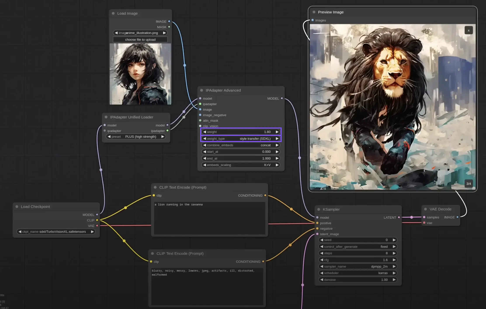

# Assignment Set #2: Building Systems with ComfyUI

This Unit will culminate in the creation of a **custom imaging system** in ComfyUI, due on Thursday, February 6. (Possibly moving to Tuesday 2/11). 

* 2.1. Technical Overview of Stable Diffusion *(20 minutes, due Thursday 1/30)*
* 2.2. ComfyUI Ecosystem Exploration *(40 minutes, due Thursday 1/30)*
* 2.3. Readings *(30 minutes, due 2/4)*
* 2.4. Helpful Viewings *(30 minutes, due 2/4)*
* 2.5. Image Analysis with Comfy *(60 minutes (?), due 2/4)*
* 2.6. Style Transfer + Upscaling in Comfy *(60 minutes (?), due 2/4)*
* 2.7. A Generative System in Comfy *(6 hours, due 2/11)*

---

## 2.1. Technical Overview of Stable Diffusion

### *(20 minutes, due Thursday 1/30)*

*There is no deliverable for this exercise, but it's still important.*

* **Watch** [*How Do Diffusion Models like Midjourney and Stable Diffusion Work?*](https://www.youtube.com/watch?v=BWUApLkLH-8) (19 minutes) by Derrick Schultz, **AND/OR**
* **Read** [*Bare-Bones Diffusion Models*](https://madebyoll.in/posts/dino_diffusion/) by Ollin Boer Bohan, and **play** with his interactive demonstration [here](https://madebyoll.in/posts/dino_diffusion/demo/).

---

## 2.2. ComfyUI Ecosystem Exploration 

### *(40 minutes, due Thursday 1/30)*

* **Browse** the RunComfy [readymade workflows](https://www.runcomfy.com/comfyui/)
* **Browse** the models available [at Civitai](https://civitai.com/models) (*content warning!*)
* **Browse** the 6000+ [ComfyUI Extensions & Nodes](https://www.runcomfy.com/comfyui-nodes) available at RunComfy

**View/skim** the following resources. Make a mental note about the one(s) you think might be useful for you: 

* [Beginner's Guide to ComfyUI](https://aituts.com/comfyui/)
* [ComfyUI Shortcuts](https://blenderneko.github.io/ComfyUI-docs/Interface/Shortcuts/)
* [ComfyUI Github](https://github.com/comfyanonymous/ComfyUI/blob/master/README.md)
* [ComfyUI Examples](https://github.com/comfyanonymous/ComfyUI_examples)
* [ComfyUI Reddit](https://www.reddit.com/r/comfyui/)
* [Excellent intro page](https://www.latent.space/p/comfyui)
* [ComfyUI for Everything (other than stable diffusion)](https://www.youtube.com/watch?v=fUcDAExxndQ&t=0)

**Peek** at these ComfyUI tutorial channels: 

* [Pixaroma ComfyUI YouTube Tutorials](https://www.youtube.com/playlist?list=PL-pohOSaL8P9kLZP8tQ1K1QWdZEgwiBM0)
* [Derrick Schultz YouTube Tutorials](https://www.youtube.com/watch?v=NoB1E3nZnUk&list=PLWuCzxqIpJs8e8fET1QP96tWngqlsoIZu&index=2)
* [Purz ComfyUI YouTube Channel](https://www.youtube.com/@PurzBeats) (now on Patreon)

*Now,*

* In the Discord channel `2-2-ComfyResources`, briefly **report** on something you came across that you found intriguing: **Describe** it in a sentence or two, and, if possible, **include** a link and image. **Write** a sentence about why you found it interesting. 

---

## 2.3. Readings

### *(30 minutes, due 2/4)*

* Briefly **read** these three articles:
  1. Reading: [Will AI ever be able to write a good song?](https://www.theredhandfiles.com/considering-human-imagination-the-last-piece-of-wilderness-do-you-think-ai-will-ever-be-able-to-write-a-good-song/), by Nick Cave
  2. Reading: [The Algorithmic Gaze: Representations of Women in AI Art](https://www.lerandom.art/editorial/the-algorithmic-gaze-representations-of-women-in-ai-art), by Danielle King
  3. Reading: [Unnatural Images: On AI-Generated Photographs](https://www.journals.uchicago.edu/doi/10.1086/731729), by Amanda Wasielewski
* **Create** a post in the Discord channel, `2-3-readings`
* In your post, **write** a brief response to something that stuck with you from the reading. 

---

## 2.4. Helpful Viewings

### *(30 minutes, due 2/4)*

Here are some helpful viewings to give you some valuable ComfyUI instruction. Please do these; later work will make use of this information.

* [Intro to the ComfyUI Manager](https://www.youtube.com/watch?v=4M_R1heWGWs) (9 minute video)
* [Upload Base Models to RunComfy](https://www.youtube.com/watch?v=dOCTwnrWi7g) (13 minute video)
* [How to Add a LoRa to Your Workflow in ComfyUI](https://medium.com/@promptingpixels/how-to-add-a-lora-to-your-workflow-in-comfyui-b5635cd7a8aa) (4 minute read)

---

## 2.5. Image Analysis with Comfy

### *(60 minutes (?), due 2/4)*

Your jobs in this exercise are: 

1. to **get** a provided workflow working, 
2. to make sure you **understand** all of its components, and
3. to **speculate** (or perhaps even experiment!) about how you might use its results.

You are here provided with the following resources:
 
* a ComfyUI **workflow**, in the form of a workflow-PNG: [3_image_depth_and_segmentation_sm.png](workflows/3_image_depth_and_segmentation_sm.png) (also shown above). This PNG contains a ComfyUI network in its metadata. 
* the same workflow [in a **JSON** file format](workflows/3_image_depth_and_segmentation.json), just in case you have any problems using the workflow-PNG. 
* a high-resolution **input image** of an elephant, [original_rgb.png](img/original_rgb.png).
* a **tutorial document** which explains in detail how to get this working, [located here](https://github.com/golanlevin/60-212/blob/main/lectures/comfy/image_analysis/readme.md) — *just skip the final part about using the results in p5.js.*

The provided workflow does the following things: 

* It **resizes** the input image to a smaller size, 640 pixels across;
* It uses the *Florence2* custom node to **detect the bounding box** of the elephant; 
* It uses the *SAM2Segmentation* custom node to **create a segmentation mask** of the elephant;
* It uses the *DepthAnythingV2* custom node to **estimate a depth-image** of the elephant.

*Now, do the following:*

* **Load the workflow-PNG** into RunComfy, so that the node network is loaded. 
* Missing nodes will be marked in red. **Install the missing nodes** using the Manager. (Remember to restart the Comfy server and refresh your browser after doing so.)
* **Run** the network, and **ensure** that it's working. 
* **Carefully examine** the network. **Ensure** you know what each node does. **Ensure** you know why it is connected the way it is. If you don't understand what a node is doing, **research** information about it.
* **Swap in an input image of your own.** Compute its depth-estimation image, and the segmentation-image of its main subject.  
* **Give a holler** in the `haaaalp` channel if something isn't working!
* **Make a post** in the `2-5-image-analysis` channel in Discord.
* In the post, **upload** your original image, its depth image, and its segmentation image.
* In the post, **write** a sentence or two about how you might *use* the depth image and/or the segmentation image for further operations *within ComfyUI*. What might you *do* with these things? How could they be helpful, or allow you to do interesting things? 

---

## 2.6. Style Transfer + Upscaling in Comfy

### *(60 minutes (?), due 2/4)*

In this exercise, you will use 2 custom nodes (IPAdapter Plus and Ultimate Upscaler) — in order to make a high-resolution version of a style-transfer image. Use these to make an image that interests you: 

1. The *IPAdapter Plus* node allows you to do **single-image style transfer**: Creating "image X in the style of image Y".
2. The *Ultimate Upscaler* node... upscales images! Use it to create a high-res version of your style-transferred result. 

* First, **follow** this tutorial, ["A Detailed Guide to Mastering ComfyUI IPAdapter Plus (IPAdapter V2)"](https://www.runcomfy.com/tutorials/comfyui-ipadapter-plus-deep-dive-tutorial). Feel free to determine which parts of this tutorial are relevant to you (you don't have to do *all* of it) —  but I recommend especially part 6, "Style and Composition", shown above. The main idea is for you to use the *IPAdapter Plus* node.
* **Note** that you will likely need to use the ComfyUI Manager to install the special custom nodes. (After you install the custom node(s), remember to restart the RunComfy server and refresh your browser page!)
* **Use** the IPAdapter Plus node to generate a style transferred image. 
* Then, **use** Ultimate Upscaler to upscale your result! [Here's a video about how to do that](https://www.youtube.com/watch?v=CxB47DMEyYQ).
* **Export and save** a copy of your workflow to your laptop — ideally, as a workflow-PNG. 
* **Create** a post in the Discord channel `#2-6-ipadapter`
* In the post, **upload** your style reference image, and your (upscaled) generated image.
* In the post, **upload** your workflow-PNG, if you have one. 
* In the post, **write** a sentence or two about your process, and/or what you learned or noticed.

---

## 2.7. A Generative System in Comfy *(6 hours, due 2/11)*

* **Research** custom Comfy nodes that do interesting things. 
* **Create** a generative system using ComfyUI. Use it to create at least 3 outputs. It's OK to adapt a pre-existing workflow, but you might learn more by starting from scratch. 
* **Create** a post in the Discord channel `#2-7-system`. 
* **Write** a paragraph about what your project is/does. Include some text acknowledging credit to custom nodes that you used, and/or workflows that you adapted.
* **Include** embedded image(s) and/or links to an unlisted YouTube video.
* **Include** an exported workflow-PNG.

