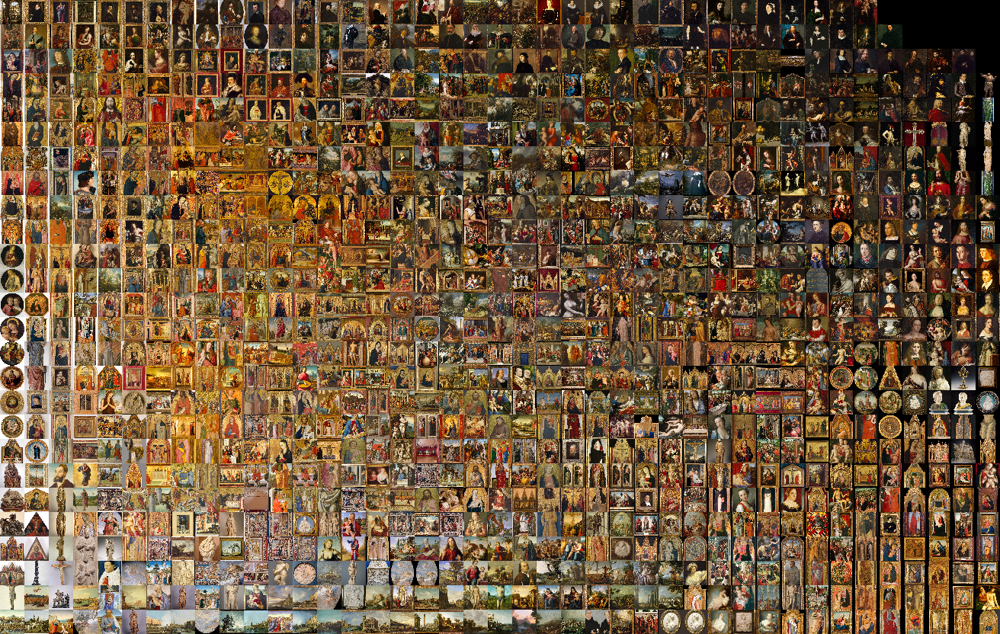

# Assignment Set #3: Collecting Data, Training Models

In some sense, 

* *Datasets are the locus of creativity in Machine-Learning-based art.*
* *Datasets are the hardest part in Machine-Learning-based art.*

This unit is concerned with data sovereignty. We will collect our own training dataset(s), and train our own model(s) with it. Along the way, we will use machine learning to understand something about our datas' structure. 

* 3.0. Viewing: [Corpora as Medium](https://www.youtube.com/watch?v=IYNKs8vfocc)
* 3.1. Viewing: [Exposing AI](https://exposing.ai/)
* 3.2. Reading: [Typologies](https://www.photopedagogy.com/typologies.html)
* 3.3. Contemplate & Forage: Datasets Proposals 
* 3.4. (Draft) Collection: Bring in 500 Images
* 3.5. Produce a rectified embedding grid visualization
* 3.6. Train a LoRA
* 3.7. Use your LoRA
* 3.8. Train a GAN *(weather permitting)*

--- 

## 3.0. Viewing: [Corpora as Medium](https://www.youtube.com/watch?v=IYNKs8vfocc)

*(Due: Tuesday 2/18, 25 minutes):*

* **Watch** this 23-minute artist lecture by Everest Pipkin (CMU MFA 2017), "[Corpora as medium: on the work of curating a poetic textual dataset](https://www.youtube.com/watch?v=IYNKs8vfocc)" 
* In the `#3-0-viewing` Discord channel, **write** a sentence of reflection on something you found interesting in this talk. 

---

## 3.1. Viewing: [Exposing AI](https://exposing.ai/)

*(Due: Tuesday 2/18, 10 minutes):*

* **Examine** (for 10 minutes) [Exposing AI](https://exposing.ai/), "an art and research publication investigating the ethics, origins, and individual privacy implications of face recognition datasets created 'in the wild.'"
* In the `#3-1-viewing` Discord channel, **write** a sentence of reflection on something you found interesting in this site. 

---

## 3.2. Reading: [Typologies](https://www.photopedagogy.com/typologies.html)

*(Due: Tuesday 2/18, 10-20 minutes):*

* **Read** this article on [Typologies](https://www.photopedagogy.com/typologies.html) (10 minutes). 
* *Optionally*, feel free to **browse** these lecture notes from my *Experimental Capture* course, featuring examples of artworks that use (or consist of) custom image capture systems: 
  * [Portrait capture systems lecture](https://github.com/golanlevin/ExperimentalCapture/blob/master/docs/portraits_1_series.md): 
  * [Candid capture machinery lecture](https://github.com/golanlevin/ExperimentalCapture/blob/master/docs/portraits_2_candid_machinery.md)
  * [Indirect Portraiture lecture](https://github.com/golanlevin/ExperimentalCapture/blob/master/docs/portraits_3_indirect_portrait.md)
* In the `#3-2-reading` Discord channel, **write** a sentence of reflection on something you found interesting in these materials. 

---

## 3.3. Contemplate & Forage: Datasets Proposals 

*(Due: Tuesday 2/18, 1-2 hours):*

In [*Making AI Art Responsibly: A Field Guide*](https://partnershiponai.org/) by Emily Saltz, Lia Coleman, Claire Leibowicz, the authors propose *3 basic methods of obtaining a dataset:*

1. **Make** your own, from your own drawings, photography, video, etc. 
2. **Scrape** existing media.
3. **Use** existing ready-made datasets.

*Now*, 

* **CONTEMPLATE**. Take a shower. Go for a walk. 
  * **Think** about what kinds of datasets interest you. 
  * **Think** about what kinds of datasets interest you could *make*.
  * **Think** about what kinds of datasets you *might already have*. 
* **FORAGE**. 
  * **Search** and **browse** online for images, image datasets, and sources of images. These could be actual readymade datasets (that need to be curated or filtered down!), or they could be image-rich websites...such as: 
	  * [3064 image datasets at Paperswithcode.com](https://paperswithcode.com/datasets?mod=images)
	  * [Explore British Library's 1073563 photos on Flickr!](https://www.flickr.com/photos/britishlibrary/)
	  * [A list of image datasets](https://docs.google.com/spreadsheets/d/1VijZSkQbqOvsvYBXdCx9UGu5zHGZPPpzwH2uHS-2XxQ/edit?usp=sharing); [another copy](https://docs.google.com/spreadsheets/d/1fIbvZaVl0b82VflBMrfG7QIPxIBtK_w8E8ZAt-uUuAc/edit?usp=sharing)
	  * [A list of datasets in computer vision and image processing](https://en.wikipedia.org/wiki/List_of_datasets_in_computer_vision_and_image_processing)
	  * [28 Free Image Datasets for Computer Vision](https://imerit.net/blog/28-free-image-datasets-for-computer-vision-all-pbm/), [20+ Open Source Computer Vision Datasets](https://www.v7labs.com/blog/computer-vision-datasets), [Madrona's list of Public image datasets](https://www.madronavl.com/launchable/public-data-sources-images), [medical-imaging-datasets](https://github.com/sfikas/medical-imaging-datasets) etc.
* In the `#3-3-proposals` Discord channel, **describe** at least one (two would be better) **PROPOSED** examples of what you might work with for *each* of the following:
	1. Your own **selfmade** image dataset(s) -- your own photos, drawings, scans, etc.
	2. Collection(s) of online media you'd be interested to assemble by **scraping**
	3. Existing ready-made datasets (or portions of readymade datasets) that you'd like to **use**.

On Tuesday we will meet in small pod groups to discuss your proposed datasets. 

---

## 3.4. (Draft) Collection: Bring in 500 Images

* *By any means necessary,* **create or pilfer** a collection of at least 500 images. Please have this collection ready by the beginning of class.
* Using `ffmpeg`, **create** directories containing versions of your images which have been cropped and/or scaled to 128x128 and 256x256 pixels. (Make sure to retain a directory of your original, best-quality image versions!) **NEW**: Also make 32x32 pixel versions of your images as well, please. 
* Using the imagemagick `montage` command, **compile** a simple image grid of all the 128x128 images. If necessary, you may need to `brew install imagemagick` beforehand. A command for this is below. 
* In the Discord channel, `#3-4-draft-collection`, post your simple image grid. 


Generate a simple mosaic using the imagemagick `montage` command: 
```
montage fins_128x128/*.jpg -tile 32x32 -geometry 128x128+0+0 -background black output_grid.jpg
```

---

## 3.5. UMAP/t-SNE Mosaic

*Done in-class on 2/25. Produce a rectified embedding grid visualization.*

By the end of class on Tuesday 2/25, you *should* be able to **make a mosaic** that presents an image dataset in an organized way using UMAP/t-SNE. However, in case you hit any snags, be sure to finish this before class on Thursday 2/27. Your tool for doing this work is:

* [**ImageRearranger repository**](https://github.com/golanlevin/ImageRearranger/tree/master) (includes both Jupyter and Colab versions of the Python notebook)

Now,

* In the Discord channel, `#3-5-mosaic`, **post** an image of your organized mosaic. 
* **Write** a sentence or two about what the images are, and anything that occurred to you about this process. 



---

## 3.6. Train a LoRA

*Use Civitai to train a LoRA. This "should" be achievable by the end of class on 2/27, but is due no later than 3/13.*

* **Bring in** 20-500 images on Thursday 2/27. 
* Credentials for a Civitai account will be privately shared with you via Discord. 
* **Use** [Civitai to train a LoRA](https://civitai.com/models/train) using your images. 
* **Upload** your LoRA to RunComfy, and store it in the `models/lora` folder. 
* **Hook up** your LoRA in ComfyUI and use it to make "more like this, please!"
* In a post (or dedicated thread) in the Discord channel, `#3-6-lora`, **write** a sentence about what sort of data you trained your LoRA on.
* Also **upload** an image of some of your LoRA training data
* Also **upload** some examples of your LoRA in action -- some results of what it can make. 
* Also **upload** a screenshot of your LoRA workflow in ComfyYUI. 

---

## 3.7. Present or Use your Data Collection

For Thursday, March 13 (the Thursday in the first week back from Spring Break), do either of the following: 

* Complete 
* Create a high-resolution mosaci

---

## 3.X. Train a GAN *(weather permitting)*

*I've determine that I'm not able to get this working in a way which is practical for 16 students. Instead, I will present this as a classroom demonstration rather than an all-class assignment. If someone is interested, they could explore it for Project 4.* 

---

EOF

