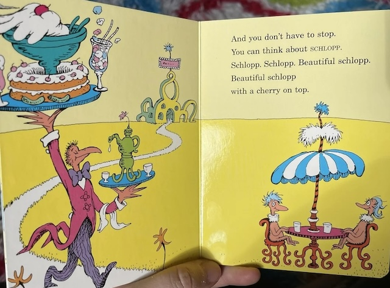

# Assignment Set #4: Off-Road Experiments

For this unit, we will turn our classroom into a Sharing Laboratory. Each day, we will have collective work sessions in which you make and share your experiments. The pressure is off to make "good" work; rather, our goal here is to **tinker freely**. For these experiments, think: less Deep Meaningful Art, more [Dumb Jokes](https://www.nytimes.com/interactive/2023/07/10/style/ai-memes-jokes.html?smid=nytcore-ios-share&referringSource=articleShare).

This set of assignments has the following components:

* 4.1. [Specify Tools in our Spreadsheet](#4-1-specify-tools-in-our-spreadsheet) — *Due 3/20; 30 minutes*
* 4.2. [Readings: Slop; Other AIs](#4-2-readings-slop-other-ais) — *Due 3/25; 40 minutes*

---

## 4.1. Specify Tools in our Spreadsheet 

*(Due Thursday 3/20. Estimated time: 30 minutes.)* 

**Identify 3 tools** (whether open-source/free or commercial) which you'd like to use to conduct lightweight, low-stakes tinkering and experiments with. 

We will have a communal spreadsheet for us to fill up with your list. (For example, personally, I want to experiment with Roboflow.) Then, I will pay the monies.

---

## 4.2. Readings: Slop; Other AIs

*(Due Tuesday 3/25. Estimated time: 40 minutes.)* 

> *Eryk Salvaggio is a researcher and new media artist interested in the social and cultural impacts of artificial intelligence. His work explores the creative misuse of AI and the transformation of archives into datasets for AI training: a practice designed to expose ideologies of tech and to confront the gaps between datasets and the worlds they claim to represent. Eryk is the Emerging Technology Research Advisor for the Siegel Family Endowment, a philanthropic organization focused on responsible technology, and a researcher with AI Pedagogy Project with the metaLAB at Harvard University.*

For **Tuesday, March 25**, please:

* **Read** the following two recent articles by artist and media theorist Eryk Salvaggio:
  1. Eryk Salvaggio, [*Slop Infrastructures*, Parts 1 and 2](https://mail.cyberneticforests.com/slop-infrastructures-1-2/), 12/2024. *(12 minute read)*
  2. Eryk Salvaggio, [*Are Other AIs Possible?*](https://mail.cyberneticforests.com/sp/), 1/2025. *(15 minute read)*
* **Create** a post in the Discord channel, `#4-2-readings`.
* In your post, **write** a couple of sentences responding to the readings. For example, you might point out something that struck you as interesting, or that you disagreed with, etcetera. 

---

## 4.3. 

You will be expected to document at least two of your experiments and workflows -- in a such a way that you are effectively sharing your learnings in enough detail that you save your classmates some time if they decide to explore that tool later on.

---

EOF