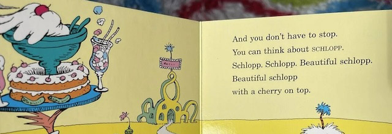

# Assignment Set #4: Off-Road Experiments

---

## 4.1. Readings: 

* Nick Cave, [*Will AI ever be able to write a good song?*](https://www.theredhandfiles.com/considering-human-imagination-the-last-piece-of-wilderness-do-you-think-ai-will-ever-be-able-to-write-a-good-song/), 1/2019 *(3 minute read)*
* Eryk Salvaggio, [*Slop Infrastructures*, Parts 1 and 2](https://mail.cyberneticforests.com/slop-infrastructures-1-2/), 12/2024. *(12 minute read)*
* Hito Steyerl, [*In Defense of the Poor Image*](https://www.e-flux.com/journal/10/61362/in-defense-of-the-poor-image/), 11/2009. *(20 minute read)*
* Dylan Schenker, [*In Defense of AI Slop*](https://teratologies.substack.com/p/in-defense-of-ai-slop), 1/2025. *(12 minute read)*

---

