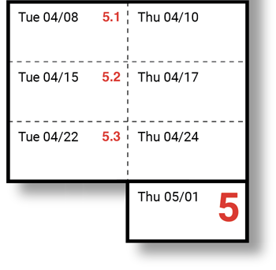

# Assignment #5: Self-Directed Final Project

*Final Presentations for our class will take place Thursday, May 1st, from 9am - 11:30am.* 

---

This project has five milestones — each consisting of a post on your named Discord channel (e.g. `#5-golan` etc.):

* `Tue Apr 08:` 5.1 — **Proposal**
* `Tue Apr 15:` 5.2 — **Technical Milestone**
* `Tue Apr 22:` 5.3 — **Draft Artwork**
* `Thu May 01:` 5.4 — **Final Project Presentation**
* `Mon May 05:` 5.5 — **Deadline for Documentation**

---

# Connect AI to Your Practice

Our final assignment is an open-ended, self-directed final project in which you are invited to find a way to expand your own creative practice through AI techniques. Possible final projects could be things like: 

* a printed book, zine, or comic
* a deck of cards, featuring a collection of images
* an animation or short film
* a series of ultra-short videos or GIFs (e.g. for social media)
* a song or collection of songs
* a podcast, radio play, or book-on-tape
* an interactive website or installation
* an immersive virtual environment
* a custom software system or tool
* a virtual or 3D-printed sculpture
* a wearable garment or fashion line
* an intervention in online or public space
* a custom-trained model
* a research investigation

*This list is not exhaustive!*

## Deliverables

In our Discord, there will be a channel specifically dedicated to your project, such as `#5-golan`. You are asked to document your work in posts on this channel, and journal your project's development there on a weekly basis, as follows:

#### 5.1. Proposal 
*Due Tuesday 4/8.* In a post in your Discord channel, **write** a paragraph explaining what you'd like to make. **Describe** what you're curious about researching, and why, and how it connects to your creative interests. **Include** some links to references, inspirations, and/or your own prior work (whether technical or artistic). **Include** some images: these could be rough sketches, prior work, etc. **Provide** some links to the tools or techniques you think you might use. **Explain** what you think might be the main challenge you face.

#### 5.2. Technical Milestone
*Due Tuesday 4/15.* This is the "get something working" deadline. By this date, you are strongly encouraged or expected to **resolve** a major technical question. **Explain** what you were trying to achieve, and **document** your technical struggles in a post in your Discord channel. It doesn't have to be art, yet. 

#### 5.3. Draft Artwork
*Due Tuesday 4/22.* **Present** a rough sketch of what the final project will be. This could be a sample page from a book, etc. **Explain** where things are going, and how your plans are changing as the rubber meets the road. **Include** an image or screenshot to document your process. 

#### 5.4. Final Project Presentation
On Thursday May 1st, you'll **present** your final project in a special morning session of the class. (The format of this session is TBD; it might be serial presentations, or it might be science-fair style.) A Discord post is recommended but not required here. 

#### 5.5. Final Project Documentation
*Due Monday, May 5th by Noon.* Document your final project. **Include** both *remote* links to the project itself (such as an unlisted YouTube video, Google drive PDF, or GitHub repository), as well as *local* (embedded) media within Discord that can adequately represent the project: embedded screenshots, photos, GIFs, etc. **Write** a narrative that explains what the project is, how you developed it, what you learned in the process, and how you evaluate the results. 

---

EOF