# Tuesday, January 21

---

### Agenda

* Attendance
* More Results from Welcome Questionnaire
* Proposed Due Dates
* "Glitches" Review
* Puppets Review (Now? or 1/28?)
* Presentation: Realtime AI-Based Image Synthesis (Continued)
* Presentation: Expanded Body References
* Time Permitting / Postponed: [Bias and AI](https://github.com/golanlevin/lectures/tree/master/lecture_ai_bias)

---

## (More) Results from Welcome Questionnaire

* See the `#main-chatter` channel in our Discord. 
* We might have some small pod meetings at some point, dividing the class into the following groups to share and discuss findings: 
  * Text/Poetry Club
  * Sound, Music, and Speech Club
  * 3D, IRL, and Physical Output Club

---

## Proposed Due Dates

1. **`Tue Jan 28`** Using commercial tools (Runway, MidJourney)
2. **`Thu Feb 06`** Selfmade AI Systems (ComfyUI)
3. Selfmade Data (Scrape, Colab, UMAP, LoRA, ComfyUI):
  * **`Thu Feb 27`** Part 3a (Scrape, Visualize)
  * **`Thu Mar 13`** Part 3b (Train, Use)
4. **`Tue Apr 01`** Going Off-road (explore some tools/algos you discover.)
5. Self-Directed Final project
  * **`Thu Apr 24`** (Draft for Feedback) 
  * **`On or Before 05/05`** Final Show

---

## Realtime AI-Based Image Synthesis (Continued)

Last week we mentioned the following examples of *realtime* generative-AI imaging (which is technologically demanding to do): 

* Aman Tawari and Gray Crawford (2019), [*Xoromancy*](https://studioforcreativeinquiry.org/project/xoromancy)
* Memo Akten, [Learning to See](https://www.memo.tv/works/learning-to-see/)
* David Rokeby, [Voice Scroll](https://bmolab.artsci.utoronto.ca/?p=3454)
* Hughes Bruyere, [Magic Clay](https://www.instagram.com/p/C8QGJ2cvW-Y/?hl=en)

Here are some more systems that use AI in realtime: 

* Hughes Bruyere, [Quest 3 passthrough processed in real-time with ComfyUI](https://www.instagram.com/p/DFBWHudyG8O/)
* Kyle McDonald and Daito Manabe, [Transformirror](https://www.instagram.com/p/C4Rl0m-xXCT/)
* Parag Mital, ["Visual Smash Up"](https://www.youtube.com/watch?v=bFj-RWic4QQ&t=1200s) (2012): "The system learns objects from the camera image and displays the a visual mosaic in which it uses what it has seen before to represent what it sees now. Only unique objects are learned creating a hallucinatory resynthesis of the original camera image. For instance, all keyboard letters are replaced by only a single letter since based on purely visual appearance, a single letter is adequate to portray the keyboard."
* Memo Akten, ["Learning to See: Hello World"](https://www.memo.tv/works/learning-to-see-hello-world/) (2017)

---

## The Reimagined Body, Towards Self-Portraiture

As someone reviewing undergraduate portfolios this week, I'm seeing a lot of [**Character Design**](https://topartcollege.com/2023/08/23/how-to-make-character-designs-for-your-art-portfolio-that-will-impress-admissions-counselors/), similar to this template below. If your dream has always been to design characters, our [Dreamworld Self-Portrait](https://github.com/golanlevin/gen-ai/blob/main/assignments/assignment_1.md#17-dreamworld-self-portrait) assignment is finally your time!

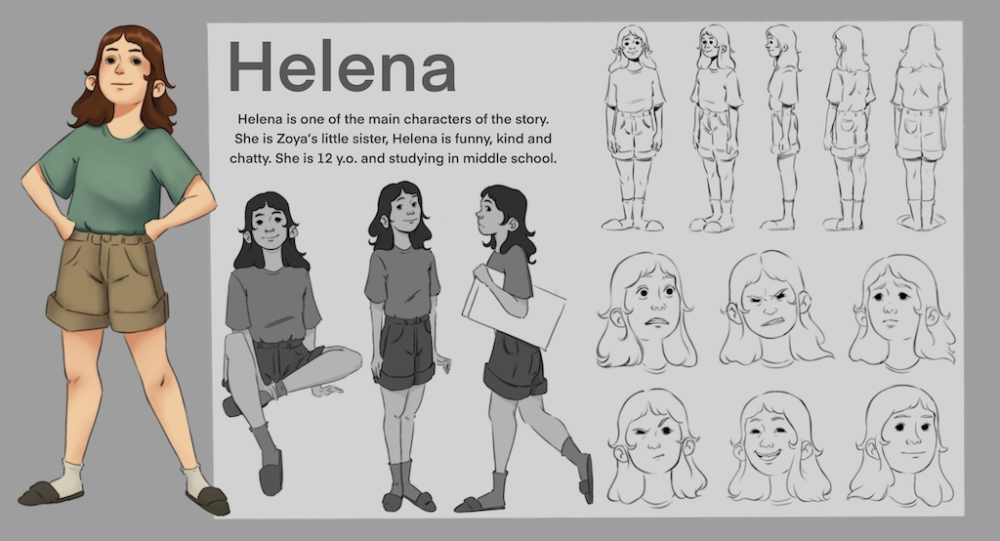

Today I'd like to expand our ideas a little about what characters can look like. This is is not a comprehensive presentation; but rather, just a few nudges to loosen things up. 

In 1910-1912, [Léon Bakst](https://en.wikipedia.org/wiki/L%C3%A9on_Bakst) developed costumes for ballet performances by Nikolai Tcherepnin. In addition to creating "character designs", Bakst also took on the additional challenges of depicting the characters in motion, and developing these into compelling compositions on the page.

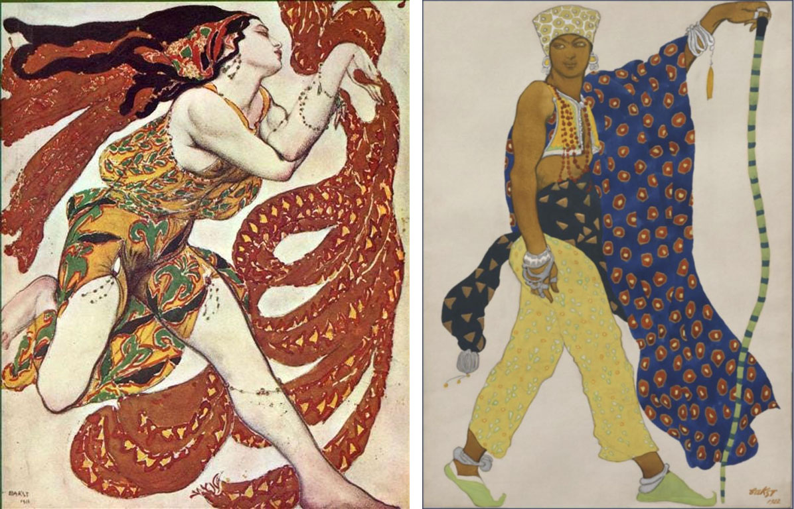

[Niki de Saint Phalle](https://nikidesaintphalle.org/) (1930–2002) was born in France and grew up in New York. She is known for creating a visual language of giant, voluptuous 'Nana' sculptures (ca. 1964-1973). Although easily interpreted as joyful, happy sculptures, the Nanas "have a powerful intention as an amplification of femininity. ‘*They are an army of women sent to take over the world*’, as Saint Phalle’s granddaughter, Bloum Cardenas, put it." Niki de Saint Phalle's insistence on exuberance, sensuality, figuration, and bold use of color often ran counter to the prevailing mid-century trends in minimalist abstraction.

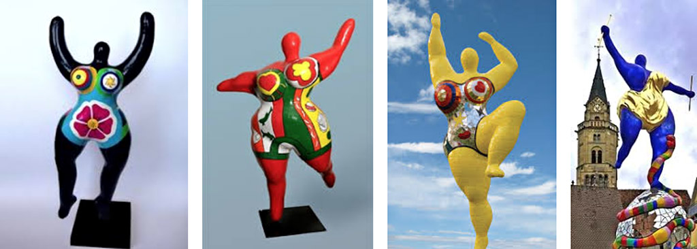

**Costumery** is a common way that we extend the appearance of the body. 

**Oskar Schlemmer** (1888-1943) was a German sculptor, designer and choreographer. In 1923 he joined the Bauhaus theater department as Master of Form, after working at the school's sculpture workshop. Some marvelously weird interpretations of the human form can be seen in Schlemmer's 1922 masterwork, *Triadic Ballet* (recreated 1970), said to be "based on math and anxiety". There are tight relationships betweeen the characters' appearance, and their styles of movement. Watch [**a minute of this video**](https://www.youtube.com/watch?v=mHQmnumnNgo&t=102s).

[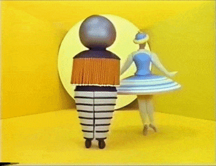](https://www.youtube.com/watch?v=mHQmnumnNgo&t=102s)

Photographer/costumer **Charles Freger** has developed Wilder Mann, [a series of portraits of costumed people](http://www.charlesfreger.com/portfolio/wilder-mann/), in outdoor environments, that are intended to explore ideas of humans in alternative 'natural' states—in some cases, halfway to animals, or vegetables. Importantly, Freger is beginning to design not just new costumes, but **new biologies**.

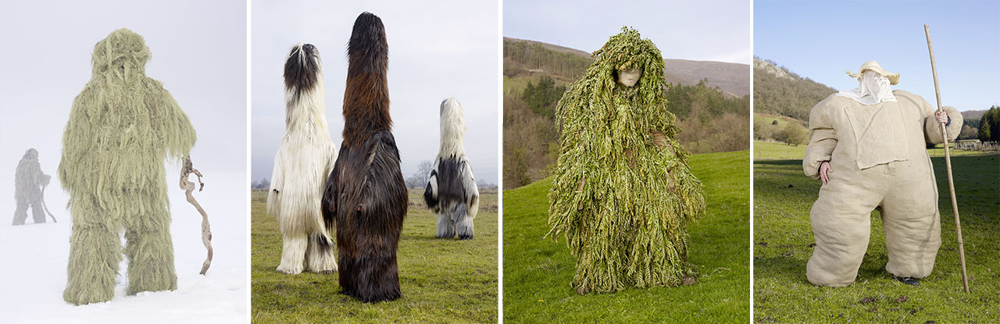

Performance artist [**Nick Cave**](https://www.youtube.com/watch?v=Hi5vRJWFxkE)'s bright, whimsical, and other-worldly **Soundsuits** — a hybrid of kinetic soft sculpture, dance costume, and body-worn percussion instrument, often created from found materials — have undoubtedly inspired a great deal of recent digital work. His artworks extend the human form visually, kinetically, and (as they often produce sound) aurally as well. Cave has produced over 500 soundsuits since 1992. Watch the [**first minute of this video**](https://www.youtube.com/watch?v=Hi5vRJWFxkE).

[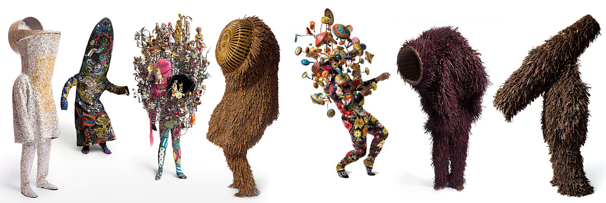](https://www.youtube.com/watch?v=Hi5vRJWFxkE)

CMU School of Art professor Suzie Silver and their partner Hilary Harp have been producing video performances speculating on extraterrestrial culture. This is "[Obligate Symbionts of Colubus Grand](https://vimeo.com/37917084)" (2012), about a binary planet system with coevolved cultures of profound mutual symbiotic reliance, and their ecstatic dance-like interactions. Watch a [minute of this video](https://vimeo.com/37917084).

[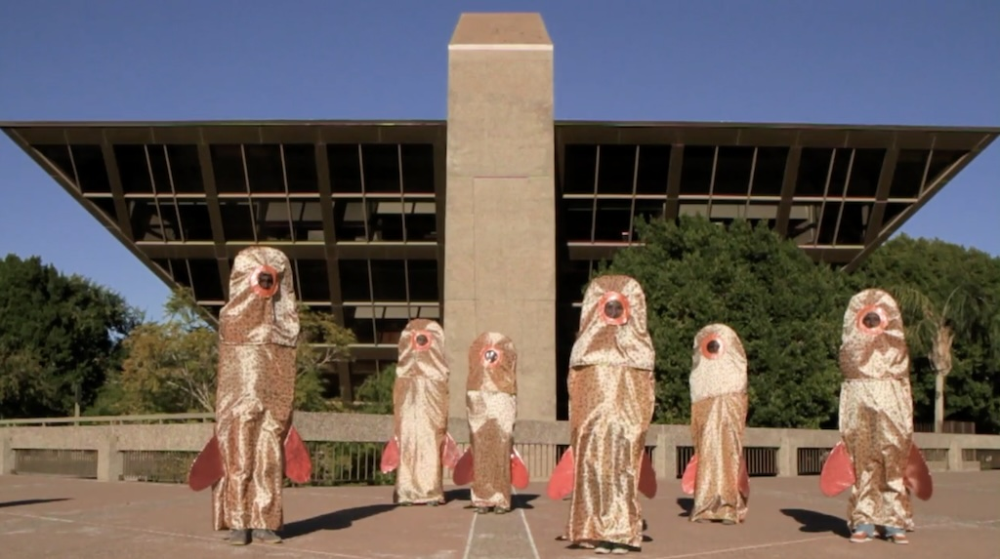](https://vimeo.com/37917084)

Obviously **CGI** interpretations of motion capture make a lot of new bodies possible. In 2009, British media artists Matt Pyke and CGI designers Universal Everything released [Furry's Posse](https://vimeo.com/7467703), a 30-second spot on MTV: 

[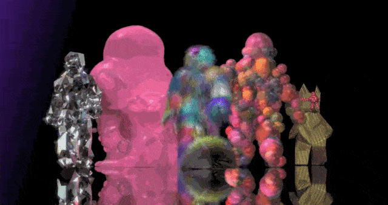](https://vimeo.com/7467703)

Freelance motion graphics designer [**Esteban Diacono**](https://www.instagram.com/_estebandiacono/) maintains an active Instagram account. His imaginative transformations of the motion-captured human form are distinguished by their use of physics (especially of apparently non-living materials) as an augmentation strategy. 

[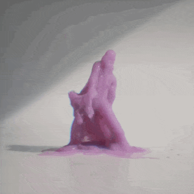](https://www.instagram.com/p/BXXo9PDhQ9Y/)
[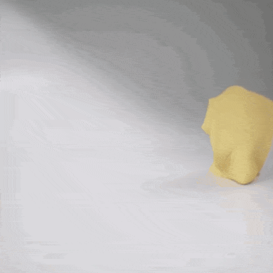](https://www.instagram.com/p/BV-QESRhrOu/)

And now, **AI**.

**Alejandro Jodorowsky** was a visionary Chilean filmmaker, who in the post-psychedelic 1970s attempted to make a feature film version of “Dune.” He worked for two years with a super-team of artists, including Swiss artist H.R. Giger and France’s greatest comics artist, Jean "Moebius" Giraud, who drew more than 3,000 storyboard sketches. Jodorowsky presented his massive compendium of artwork to the Hollywood studios, who turned it down. *Nevertheless*, writes the NYTimes, 

> This unfilmed film’s influence on our culture is nothing short of astounding. [Images from the “Dune” art bible escaped into the world](https://www.iamag.co/the-art-of-jodorowskys-dune/). They can be experienced in movies such as “Blade Runner,” “Raiders of the Lost Ark,” “Prometheus,” “The Terminator” and even the original “Star Wars.” His “Dune” does not exist, yet it’s all around us.

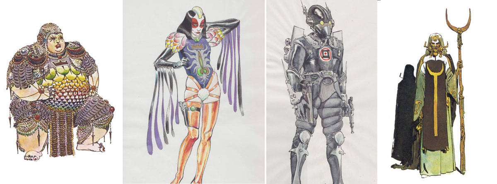

Recently, the NYTimes asked Midjourney artist Johnny Darrell to prompt “*production still from 1976 of Alejandro Jodorowsky’s Tron*” to produce the illustrations in this NYTimes article, "[Alejandro Jodorowsky’s 1976 version of 'Tron'](https://www.nytimes.com/interactive/2023/01/13/opinion/jodorowsky-dune-ai-tron.html?unlocked_article_code=1.q04.m6NE.FeLY6VbnN9dB&smid=url-share)" 

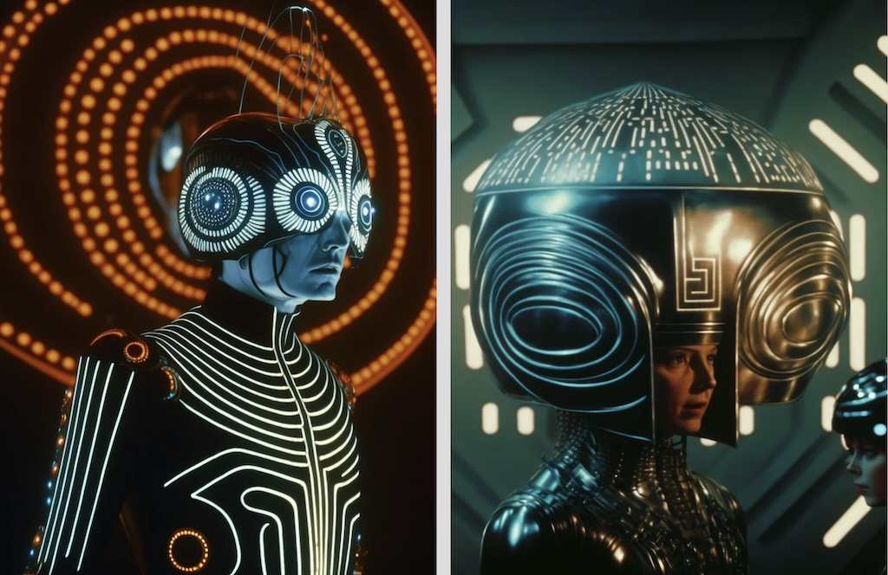

Media artist **David Szauder** (b. 1976 in Hungary) has been teaching ‘AI’ courses at Moholy-Nagy University of Art and Design in Budapest. You might like his [Anatomy Sweaters](https://www.davidarielszauder.com/#/anatomy-sweaters/), which he uses AI to help design. He has created an [Instagram full of imaginary characters](https://www.instagram.com/davidszauder/): 

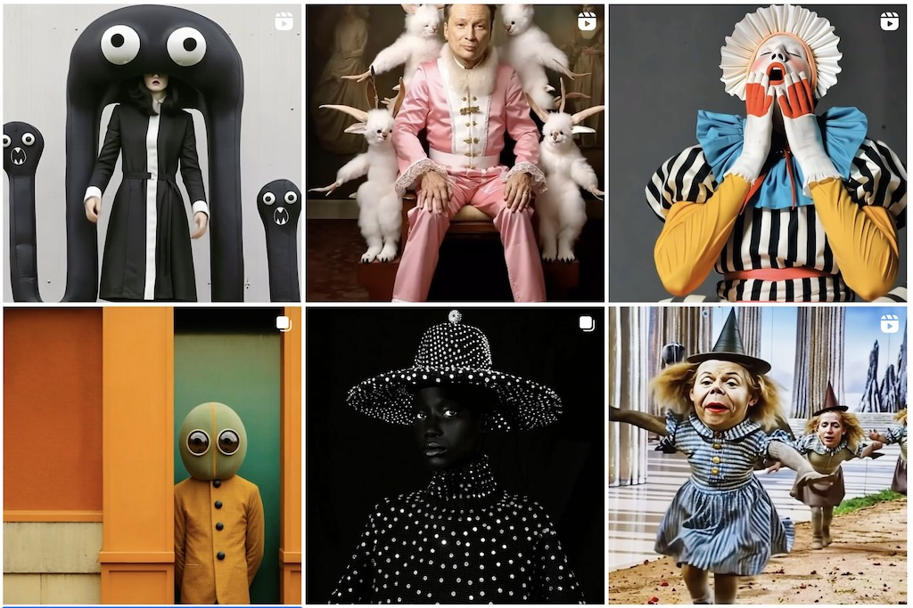

and an [impressive series of self-portraits](https://www.davidarielszauder.com/#/me-myself-and-ai/) inspired by art history: 

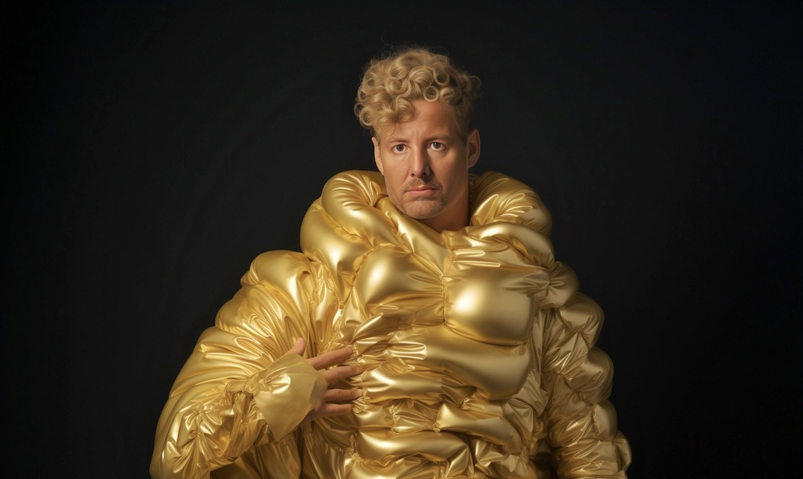

And then there's whatever is going on here, by [@billyfromthevoid](https://www.instagram.com/billyfromthevoid):

[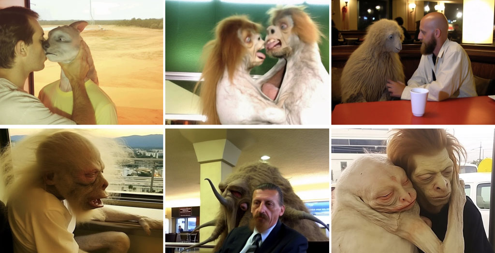](https://www.instagram.com/billyfromthevoid)

Finally, there is "[Fighting Windmills](https://verse.works/series/fighting-windmills-by-addie-wagenknecht)" by Addie Wagenknecht (2023). The artist as a deepfake confronts a deepfaked doppelgänger in a boxing ring, symbolizing the internal battle against self-sabotage and the weight of imposed standards.

[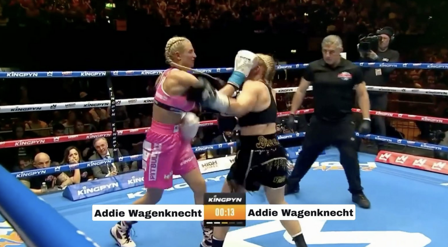](https://verse.works/series/fighting-windmills-by-addie-wagenknecht)

---

### Some AI Lecture

* [More Like This, Please: Programming with Examples](https://golancourses.net/60120/daily-notes/unit-1/machine-learning-art/)
