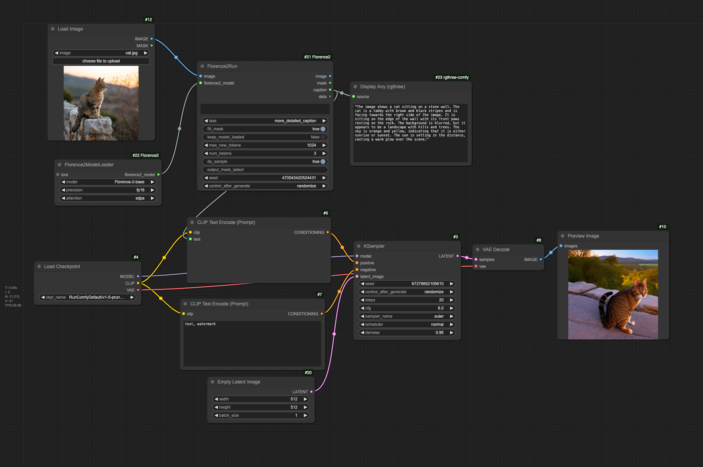
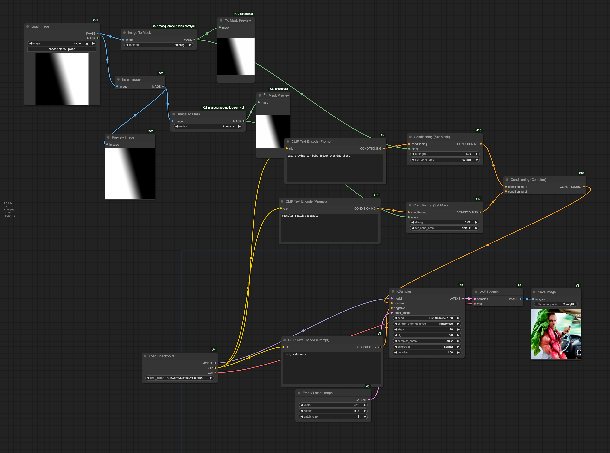
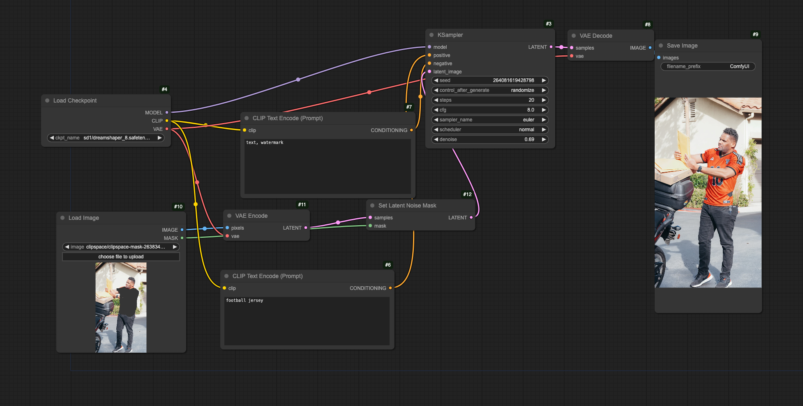

# Thursday, January 30

---

## Agenda

* Attendance
* Make and pay for RunComfy accounts!
* **Reminder about exercises due Tuesday 2/4:** 
	* [2.3. Readings](https://github.com/golanlevin/gen-ai/blob/main/assignments/assignment_2.md#23-readings) (30 minutes, due 2/4)
	* [2.4. Helpful Viewings](https://github.com/golanlevin/gen-ai/blob/main/assignments/assignment_2.md#24-helpful-viewings) (30 minutes, due 2/4)
	* [2.5. Image Analysis with Comfy](https://github.com/golanlevin/gen-ai/blob/main/assignments/assignment_2.md#25-image-analysis-with-comfy) (60 minutes (?), due 2/4)
	* [2.6. Style Transfer + Upscaling in Comfy](https://github.com/golanlevin/gen-ai/blob/main/assignments/assignment_2.md#26-style-transfer--upscaling-in-comfy) (60 minutes (?), due 2/4)

---

## Workflows from Class

*The images below are ComfyUI workflow-PNGs, which have Comfy node networks embedded in their image metadata. You can upload these PNGs directly into RunComfy to recover the networks.* 

1. Cat Describer Workflow
2. Radish Baby (Masked Latent) Workflow
3. Prompted Inpainting Workflow

---

### 1. Cat Describer Workflow

* Load a 512x512 [**image of a cat**](workflows/cat.jpg) (available here)
* Use the *Florence2Run* node to automatically caption it
* Use the caption as the CLIP text prompt for Stable Diffusion
* *Voilà*, a "conceptual copy" of the original cat image

### 2. Radish Baby (Masked Latent) Workflow

* Load a 512x512 [**gradient image**](workflows/gradient.jpg) (available here)
* Convert the gradient into a Comfy mask object
* Also, make an inverted copy of the gradient, and make a mask from that too
* Build a pair of masked conditioners with the pair of complementary masks. 
* Give different prompts ("muscular radish", "baby driving") to each of the masked conditioners. 
* Combine the masked conditioners and proceed with Stable Diffusion
* *Voilà*, an image which conceptually crossfades from a "muscular radish" to a "baby driving".

### 3. Prompted Inpainting Workflow

* Load an image of a [**man looking confused**](workflows/pexels-photo-6867962.jpg) (available here)
* Use the mask painter tool to create a mask of his shirt
* Use the mask to set up the *Set Latent Noise Mask* node, which will regulate which pixels will undergo Stable Diffusion, and which pixels won't. 
* Proceed with Stable Diffusion. Now, only his shirt will be affected by the Stable Diffusion prompt ("football jersey"). 
* *Voilà*, his shirt is inpainted as a football jersey. 

<!-- 

--- 

## Hello Comfy

* Introduction to [the ComfyUI Ecosystem](https://github.com/golanlevin/gen-ai/blob/main/assignments/assignment_2.md#22-comfyui-ecosystem-exploration)
* [Clip Interrogator](https://replicate.com/pharmapsychotic/clip-interrogator) - A tool to tell us the prompt for a given image.

### Time Permitting / On Deck

* [More Like This, Please: Programming with Examples](https://golancourses.net/60120/daily-notes/unit-1/machine-learning-art/)
* [Bias and AI](https://github.com/golanlevin/lectures/tree/master/lecture_ai_bias)
* 
-->
