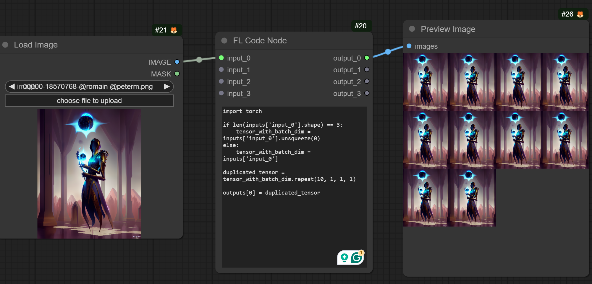
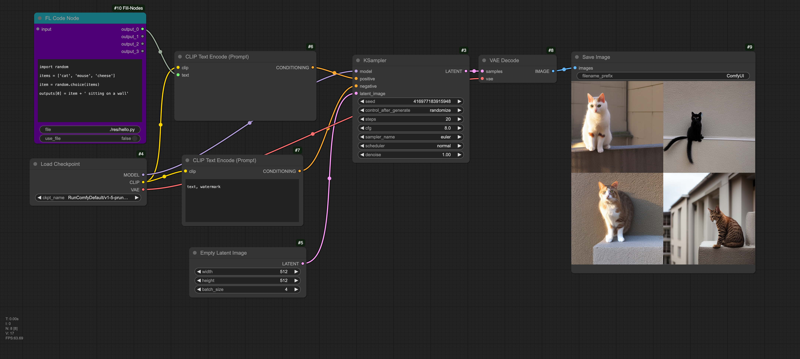

# Tuesday, February 4

---

## Agenda

* Attendance
* Quick review of exercise work for today:
	* [2.5. Image Analysis with Comfy](https://github.com/golanlevin/gen-ai/blob/main/assignments/assignment_2.md#25-image-analysis-with-comfy)
	* [2.6. Style Transfer + Upscaling in Comfy](https://github.com/golanlevin/gen-ai/blob/main/assignments/assignment_2.md#26-style-transfer--upscaling-in-comfy) 
* [**Project 2.7 (System)**](https://github.com/golanlevin/gen-ai/blob/main/assignments/assignment_2.md#27-a-generative-system-in-comfy-6-hours-due-211), [Due Date moved](https://github.com/golanlevin/gen-ai/blob/main/syllabus/schedule-new.png) (2/6 → 2/11)
* More ComfyUI Topics
   * more practice with masks
   * batch processing of images
   * control nets
   * LoRAs

---

## Findings

#### Feedback

* **Feeding back** the results of the synthesis into the input: infinite zoom img2img with feedback: [**Video Tutorial**](https://www.youtube.com/watch?v=mITVOnG9Tlg).  Use the "[Image Sender / Image Receiver](https://www.runcomfy.com/comfyui-nodes/ComfyUI-Impact-Pack/ImageSender)" nodes in the the Impact node pack. 
  * *Note that the UI has changed slightly since this video tutorial was recorded. The Checkbox in his video is the same as checking the "Auto Queue" box now (and — you have to also check the "extra options checkbox" to display it!).*
  * 
  * [infinite_zoom_workflow.json](workflows/infinite_zoom_workflow.json)
  * [nebula.png](workflows/nebula.png)

#### Cool Nodepack: Python in Comfy!

* The [**ComfyUI_Fill-Nodes pack**](https://github.com/filliptm/ComfyUI_Fill-Nodes) has some exciting offerings: 
  * [Raw Code Node](https://github.com/filliptm/ComfyUI_Fill-Nodes?tab=readme-ov-file#raw-code-node---simple-node-that-loads-python-and-allows-you-to-dev-inside-comfy-without-having-to-reload-the-instance-every-time): - Node that loads Python and allows you to dev inside comfy!
  * 
  * [code-node-workflow.json](workflows/code-node-workflow.json)
  * 
* Calling [ComfyUI from Python](https://github.com/antiboredom/creative-ml-fall-2024/tree/main/examples/comfyui-scripting) by Sam Lavigne, YMMV

---
