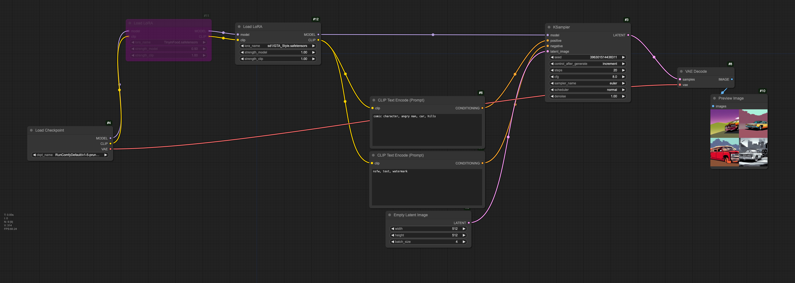
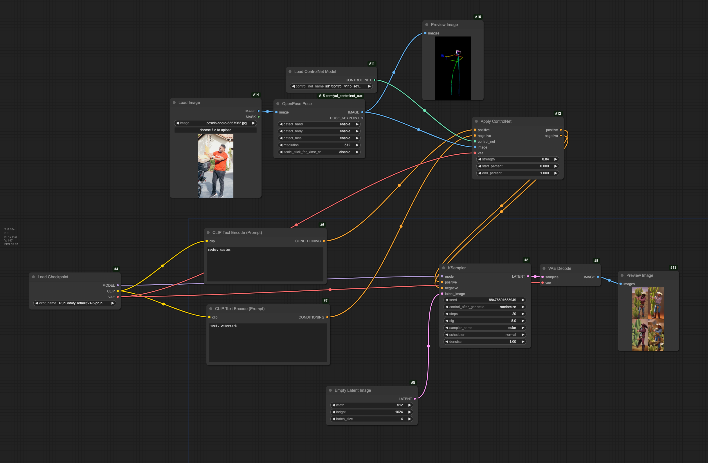
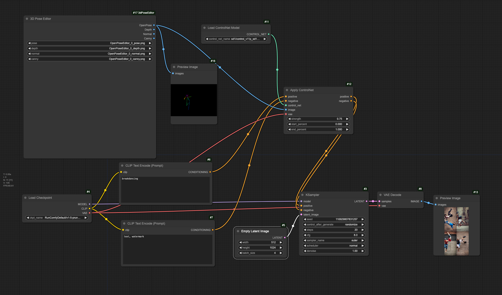
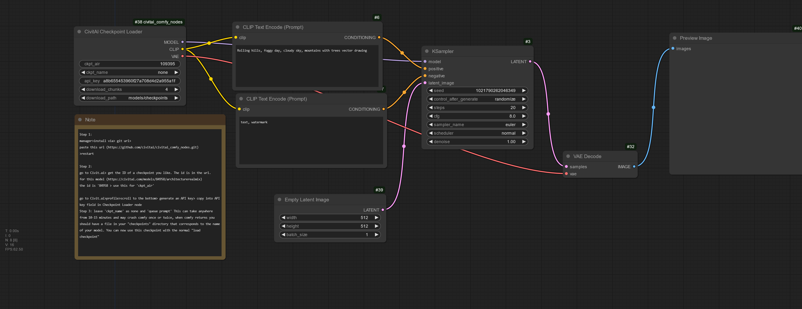
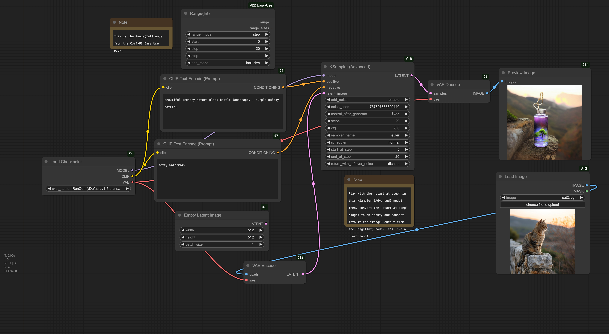
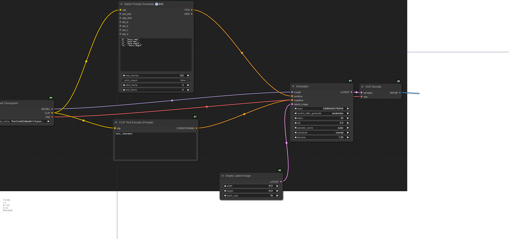

# Thursday, February 6

---

### LoRA Workflow

Workflow for using a LoRA. Note that it's possible to daisy-chain LoRAs, and that the first one here (purple) has been "bypassed": 



---

### ControlNet Workflow

ControlNets guide a Stable Diffusion process, for example with a depth image, an edge-detection, a skeleton image, or something else. Here's a ControlNet workflow which extracts the skeleton from a photo, and then uses it to scaffold (guide/condition) the synthesis of a cowboy etc.:


Here's a ControlNet in which the skeleton is configured with a custom node called the "3D Pose Editor": 

---

### CivitAI Checkpoint Loader: 

---

### Advanced KSampler and Range

This workflow demonstrates the KSampler (Advanced) node (from Comfy Core), which gives more precise control over which denoising steps are influenced by the latent conditioning image. 

This workflow also demonstrates the [Range(Int) node](https://www.runcomfy.com/comfyui-nodes/ComfyUI-Easy-Use/easy-rangeInt) from the ComfyUI Easy Use pack, which allows you to generate a range of integer values, to create a batch of images...

---

### Batch Prompting

Make a batch of prompts, so that each image has its own prompt. 

