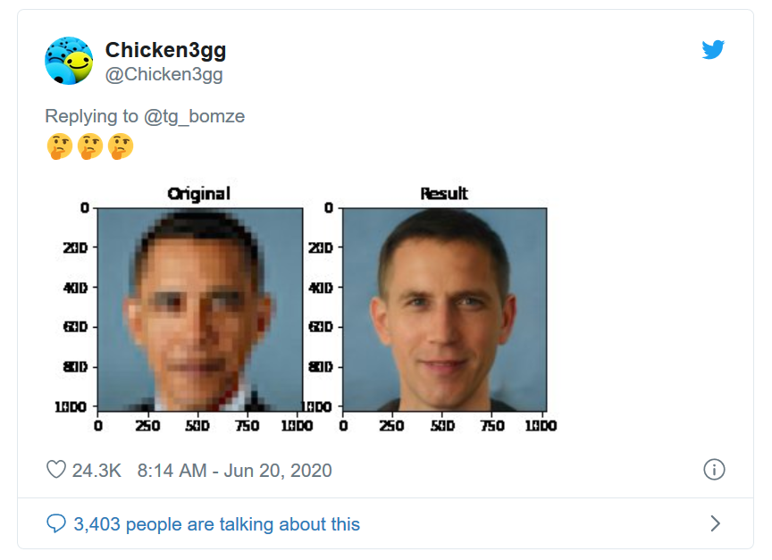

# Thursday, February 13

---

* `5:30pm Mon 2/24:` **Reminder**: [Lillian-Yvonne Bertram & Nick Montfort on AI Poetry](https://studioforcreativeinquiry.org/events/output-an-anthology-of-computer-generated-text-1953-2023-book-launch-by-lillian-yvonne-bertram-and-nick-montfort) at the STUDIO (CFA-111) - [RSVP](https://docs.google.com/forms/d/e/1FAIpQLSf8sfPBGSwafZqoRf8Sci3Ai3JQG1g9QXRq5KCPKdc4khlakA/viewform)
* Presentations of Project 2 
* Introduction to [Assignments #3](../assignments/assignment_3.md)

---

### Premade datasets are biased. 

*(Via Derrick Schultz)*

* All datasets are made by humans
* Most training datasets are designed to be very broad, often avoid niche considerations
* Almost all photograph-based
* Usually made for business or surveillance purposes, not art (face rec, self-driving cars)
* Reflect other peoples' biases.

Here's a model for upscaling faces that was trained on data with biases:

---

### Let's Make Our Own Datasets!

Dataset Normalization

1. Scrape images
2. Toss out images that are too small
3. Toss out duplicates
4. Hand curate 
5. Resize, crop, augment
6. Human review

---

## Dataset Ethics

Adapted from notes by Derrick Schultz, and from [*Making AI Art Responsibly: A Field Guide*](https://partnershiponai.org/) by Emily Saltz, Lia Coleman, Claire Leibowicz.

#### WAYS TO MAKE DATASETS

1. **Make your own!** Use your own illustrations, photography, text, or video. 
  * Safest approach, 
  * It’s all yours! :)
  * Labor-intensive
2. **Scrape existing media.**
  * Least-risky: Use media that is in the public domain (NASA, Biodiversity Heritage Library)
  * Riskier: Scraping existing media = using someone else’s data. ([Fursona controversy](https://gizmodo.com/the-internet-furry-drama-raising-big-questions-about-ar-1843412922) -  thisfursonadoesnotexist ignited a fandom firestorm when it was trained on more than 55,000 images pulled (without permission) from a furry art forum)
  * [Everest Pipkin (video)](https://www.youtube.com/watch?v=IYNKs8vfocc): “To work with generative systems is to be a curator...to curate a corpus is to value the contributions inside of it...they are still artworks individually, and the people who make them are still artists. [...] Curating your own corpora is to be able to deal with the original creators of your corpora as humans and as collaborators, not as datapoints.”
  * Give credit! [Pipkin](https://github.com/NaNoGenMo/2018/issues/110)
3. **Use existing ready-made datasets**.
  * Think about: *Who made this dataset? Why? Was the data ethically sourced?*
  * Example: MegaFace Dataset, a Public FaceRec dataset of 4.7M faces, scraped by UW from Flickr users' photo albums without permission, and then Used by Amazon, Google, Tencent, etc. for Facial Recognition

#### SUMMARY OF BEST PRACTICES

* Least risky: Use your own illustrations, photography, text, or video.
* If you are scraping work, prioritize work that is in the public domain, or directly ask for permission from those whose identity and/or work is represented in the dataset. 
* Credit the work of others whenever possible. If you are posting online, tag people and thank them!
* If your dataset has people in it, ask yourself: How would I feel if my picture- or my friends and family’s pictures- were in this dataset? How can I ask for consent?

---

## Some Art 

**NOTE**: Be prepared for the possibility that your *dataset itself*, as a never-before-seen object, or the *act of collecting* your dataset, as a kind of performance, *might be more interesting* than what you create with an AI trained on it.

Here are some artworks (both AI-based and non) that involved the creation of artists datasets. 

* Helena Sarin, [Leaves of Manifold](https://opensea.io/assets/ethereum/0x29c9e04e05c5d261836e458bc5b779a7de3c58d6/44454718090882994093426117371750302173177614072300164086807993220170969920467), ~2017
* Jenny Odell, [Satellite Collections](https://www.jennyodell.com/satellite.html), 2009-2015
* Nancy Burson, [Composites](https://clampart.com/2012/06/first-and-second-beauty-composites-left-bette-davis-audrey-hepburn-grace-kelly-sophia-loren-marilyn-monroe-right-jane-fonda-jacqueline-bisset-diane-keaton-brooke-shields-meryl-streep/burson_beauty-composite-12/), ~1980
* Jason Salavon, [Every Playboy Centerfold](http://salavon.com/work/EveryPlayboyCenterfoldDecades/) 2002; [Homes for Sale](http://salavon.com/work/Homes/), 2002; [100 Special Moments](http://salavon.com/work/SpecialMoments/) 2004.
* Luke Loeffler, [Portrait of IKEA](https://golancourses.net/2012spring/02/07/luke-loeffler-data-visualization-portrait-of-ikea/), 2012
* Maddy Varner, [Blingee Heist](https://cargocollective.com/maddyv/BLINGEE-HEIST), 2014
* Yufeng Zhao, [AllTextInNYc](https://alltext.nyc/search?q=itch)
* Caroline Hermans, [Circles of Life](https://ems.andrew.cmu.edu/excap17/caro/05/07/caro-final/index.html)
* [Crowdsourced clocks](https://github.com/golanlevin/lectures/tree/master/lecture_clock): All the Minutes by Studio Moniker, The Human Clock
* [I'm Google](https://imgoogle.dinakelberman.com/) by Dina Kelberman
* [Learning to Love you More](http://www.learningtoloveyoumore.com/reports/23/23.php) by Miranda July
* [9 Eyes of Google Streetview](https://9-eyes.com/)

AND

* [Typologies and Small Multiples](https://github.com/golanlevin/ExperimentalCapture/blob/master/docs/typologies.md): Dingle, Blossfeldt, Bentley, Becher, Ruscha, Eijkelboom, Dass, Ojeikere, Fritz
* [Image Averaging presentation](https://github.com/golanlevin/ExperimentalCapture/blob/master/docs/typologies.md#typologies-depicted-through-averaging)
* [Collections presented in time](https://github.com/golanlevin/ExperimentalCapture/blob/master/docs/typologies.md#collections-presented-in-time)

