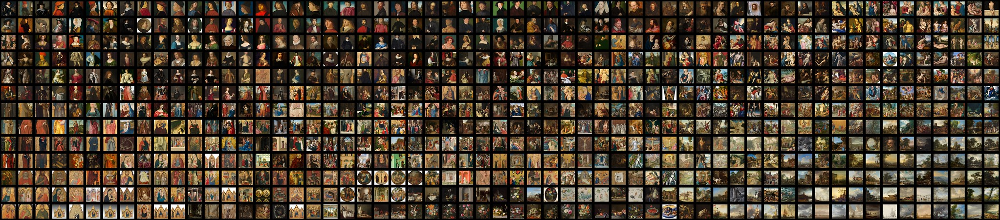

# Tuesday, February 18

---

* `5:30pm Mon 2/24:` **Reminder**: [Bertram & Montfort talk on AI+Poetry](https://studioforcreativeinquiry.org/events/output-an-anthology-of-computer-generated-text-1953-2023-book-launch-by-lillian-yvonne-bertram-and-nick-montfort) at the STUDIO (CFA-111) - [RSVP](https://docs.google.com/forms/d/e/1FAIpQLSf8sfPBGSwafZqoRf8Sci3Ai3JQG1g9QXRq5KCPKdc4khlakA/viewform)
* Presentations: 
  * Capture Machines as/in Art (presentation)
  * Analyzing Media Collections with tSNE / UMAP plots
  * Generating from Trained Datasets
  * Scraping Tools & BeautifulSoup demo
* Small-group discussions of proposed image datasets
* Lookahead at [**Assignment 3.4**](https://github.com/golanlevin/gen-ai/blob/main/assignments/assignment_3.md#34-draft-collection-500-images), due Tuesday 2/25.

---

## Capture Machines as Art / in Art

We are bearing into the problem of making collections of images, in order to (eventually) train machine learning systems. Before we head into the problems of training, let's spend a little more time considering rule-based strategies artists have used to create poignant and personal collections. 

Here is a quick dip into some additional artworks (both computer-assisted and traditional) that involved the creation of image capture *systems, algorithms, or workflows*. 

* (From [*Collections presented in time ExCap Lecture*](https://github.com/golanlevin/ExperimentalCapture/blob/master/docs/typologies.md#collections-presented-in-time)): 
  * [*A photo every day for 25 years (age 22–47)*](https://www.youtube.com/watch?v=pzyQE0WWphk), JK Keller, 1998-
  * [*Eventide*](https://vimeo.com/84883569), Cassandra C. Jones (CMU MFA project), 2004
* (From [*Candid capture machinery ExCap Lecture*](https://github.com/golanlevin/ExperimentalCapture/blob/master/docs/portraits_2_candid_machinery.md)): 
  * [*More Turns*](https://github.com/golanlevin/ExperimentalCapture/blob/master/docs/portraits_2_candid_machinery.md#more-turns), Bill Sullivan, 2006
  * [*People Staring at Computers*](https://github.com/golanlevin/ExperimentalCapture/blob/master/docs/portraits_2_candid_machinery.md#people-staring-at-computers), Kyle McDonald, 2011
  * [*Shooter*](https://github.com/golanlevin/ExperimentalCapture/blob/master/docs/portraits_2_candid_machinery.md#shooter), Beate Geissler & Oliver Sann, 2000
* (From [*Indirect Portraiture ExCap Lecture*](https://github.com/golanlevin/ExperimentalCapture/blob/master/docs/portraits_3_indirect_portrait.md)):
  * [*Lipsticks*](https://github.com/golanlevin/ExperimentalCapture/blob/master/docs/portraits_3_indirect_portrait.md#stacy-greene-lipsticks), Stacy Greene, 1992
  * [*Tracking Transience*](https://github.com/golanlevin/ExperimentalCapture/blob/master/docs/portraits_3_indirect_portrait.md#hasan-elahi-tracking-transience), Hasan Elahi, 2002-
  * [*Library of Dust*](https://github.com/golanlevin/ExperimentalCapture/blob/master/docs/portraits_3_indirect_portrait.md#david-maisel-library-of-dust), David Maisel, 2009

---

## Analyzing Media Collections with tSNE / UMAP plots

One way we can use ML is to *analyze media datasets*. This can allow us to get an *overview of a collection*, and to show us *new relationships among existing media*:

* [Feature Visualization: How neural networks build up their understanding of images](https://distill.pub/2017/feature-visualization/), Chris Olah et al., 2017
* [Understanding Neural Networks Through Deep Visualization](https://www.youtube.com/watch?v=AgkfIQ4IGaM), Jason Yosinski, 2016
* [XDegrees](https://artsexperiments.withgoogle.com/xdegrees/), Mario Klingemann + Google, 2016
* [Google T-SNE Map](https://experiments.withgoogle.com/t-sne-map), [Cyril Diagne](https://cyrildiagne.com/) + Google, 2016
* [Teenie Harris](https://studioforcreativeinquiry.org/project/thap) kiosk demo (Golan Levin et al., 2016)
* At the invitation of the National Gallery of Art, the STUDIO [helped visualize their collection](https://flickr.com/photos/creativeinquiry/48959838178/in/album-72157711499030821/), 2019  
* [MNIST digits explorer](https://dash.gallery/dash-tsne/)
* [Infinite Drum Machine](https://experiments.withgoogle.com/ai/drum-machine/view/), Kyle McDonald, 2016
* [Bird Sounds Explorer](https://experiments.withgoogle.com/ai/bird-sounds/view/), Kyle McDonald & Manny Tan, 2017

**CMU Student assignments:**

* [Ossuary](https://ems.andrew.cmu.edu/2016/zrispo/04/29/image-collection-ossuary-experiments/index.html), Zach Rispoli, 2016
* [Ecstasy Data](https://ems.andrew.cmu.edu/2016/christopher/05/04/chriswei-visualization-of-ecstasy-pills/index.html), Chris Wei, 2016
* [Skies worth Seeing](https://ems.andrew.cmu.edu/excap17/author/gloeilamp/index.html), Kaitlin Schaer, 2017 ([high-res](https://ems.andrew.cmu.edu/excap17/wp-content/uploads/2017/05/14jpeg.jpg))

## Generating from Trained Datasets

 [AI Generates Comic Panels](https://new.zachwhalen.net/projects/ai-generates-comic-panels), study by Zach Whelan, 2020

 [Performance II: Skin on Repeat](https://www.electricartefacts.art/artwork/chrystal-ding-performance-ii-skin-on-repeat), Chrystal Y. Ding, 2021

 [This Foot Does Not Exist](https://thisfootdoesnotexist.com/), MSCHF, 2019

* [The Post-Truth Museum](https://www.nora-al-badri.de/works-index), Nora al-Badri, 2020
* [Mosaic Virus](https://annaridler.com/mosaic-virus), Anna Ridler, 2019
* [Cloud of Petals](https://sarahmeyohas.com/cloud-of-petals/), Sarah Meyohas, 2021 & [Infinite Petals](https://vimeo.com/873007851)
* [This Glaze Does Not Exist](https://www.derekau.net/this-vessel-does-not-exist/2020/4/6/this-glaze-does-not-exist), Derek Kau, 2020
* [This Glaze Did Not Exist](https://www.derekau.net/this-vessel-does-not-exist/2020/12/12/gpt-2-generated-ceramic-recipes), Derek Kau, 2020

---

## Scraping Tools

As we know, scraping (i.e. pilfering from online sources) is just one way to compile a collection of images -- you could download a professionally made database, or use a camera/scanner to create your own. 

But sometimes it is the only way, especially when you wish to automate the acquisition and curation of readymade media at scale. What if you want [all of the plastic action figures at AliBaba.com](https://www.alibaba.com/trade/search?spm=a2700.galleryofferlist.the-new-header_fy23_pc_search_bar.keydown__Enter&tab=all&SearchText=action+figure)? There are more than 100 pages of results, and 48 results per page.

### Chief Obstacles to Data Scraping

*Someone has data. You want to scrape it. They make it hard to get. What obstacles do you face?*

* **Legal & Ethical Barriers** – It's not a *technical* barrier, but many sites prohibit scraping in their Terms of Service (ToS), and violating them can lead to legal consequences. Some sites aggressively block scrapers to protect intellectual property, privacy, or monetized data.
* **IP Blocking & Rate Limiting** – Websites detect high-frequency requests and block or throttle IP addresses. Scrapers must use delays, rotating proxies, or VPNs to evade bans. Some services outright deny access to non-human traffic.
* **CAPTCHAs & Bot Detection** – Advanced bot detection (like Cloudflare, reCAPTCHA) challenges scrapers with puzzles, requiring human intervention or machine-learning-based solvers to bypass.
* **Dynamic Content (JavaScript Rendering)** – Many modern sites load data via JavaScript (AJAX, infinite scroll). BeautifulSoup alone won’t always work—you may need Selenium (i.e. a headless browser) to execute scripts.
* **Anti-Scraping Headers & Tokens** – Some sites use dynamically generated CSRF tokens, session cookies, or authorization headers that must be handled to mimic real user sessions.
* **Obfuscated HTML & CSS Selectors** – Sites intentionally randomize class names, structure, or obfuscate data (e.g., hiding prices in CSS or JavaScript variables) to break predictable scrapers.
* **API Lockdown & Paywalls** – Some platforms (e.g., Twitter/X, Instagram) force users to access data via paid APIs, limiting requests and enforcing authentication. Scraping their web UI can lead to legal action or account bans.

Scraping is a **constant arms race** between scrapers and site defenses. The best scrapers adapt **like a hacker** — mimicking human behavior, rotating identities, and cleverly circumventing barriers.

### Primary Scraping Tools

*Three of the main data-scraping tools used nowadays are:* 

* [**BeautifulSoup**](https://pypi.org/project/beautifulsoup4/) – A lightweight Python library for *parsing HTML and XML*, often used with the `requests` library for simple scraping tasks. It is best for small-scale, static webpages but lacks built-in support for handling JavaScript or large-scale crawling.
* [**Scrapy**](https://scrapy.org/) – A *powerful web scraping framework in Python* optimized for large-scale, fast, and asynchronous crawling. It includes built-in caching, request handling, and export options, making it ideal for extracting structured data efficiently. However, it has a steeper learning curve than BeautifulSoup.
* [**Selenium**](https://www.selenium.dev/) – A *browser automation tool* (i.e. a fake browser) that can scrape *JavaScript-heavy websites* by simulating user interactions. It is slower than BeautifulSoup and Scrapy because it loads full web pages, making it best suited for dynamic sites that require button clicks, scrolling, or logging in.

### Beautiful Soup Demo/Tutorial

* Here's my [**BeautifulSoup Tutorial**](beautifulsoup/readme.md). Shall we try to go through it together?
* I realize this course has been billed as "no-code". While this is not a programming course (or a course which expects you to know how to *write* code), I think it is important for you to 
	* know how to *execute* someone else's code, and 
	* know how to ask ChatGPT or CoPilot to *modify* someone else's code

