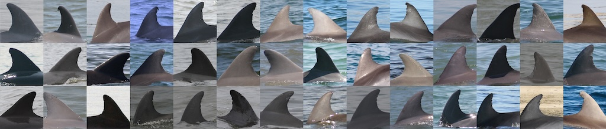
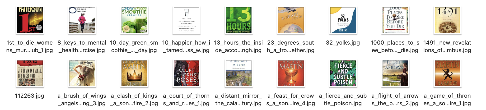

# Thursday, February 20

---

* `5:30pm Mon 2/24:` **Reminder**: [Bertram & Montfort talk on AI+Poetry](https://studioforcreativeinquiry.org/events/output-an-anthology-of-computer-generated-text-1953-2023-book-launch-by-lillian-yvonne-bertram-and-nick-montfort) at the STUDIO (CFA-111) - [RSVP](https://docs.google.com/forms/d/e/1FAIpQLSf8sfPBGSwafZqoRf8Sci3Ai3JQG1g9QXRq5KCPKdc4khlakA/viewform)
* Reminder about [**Assignment 3.4**](https://github.com/golanlevin/gen-ai/blob/main/assignments/assignment_3.md#34-draft-collection-500-images), due Tuesday 2/25.
* Why did we make AI again?
* ffmpeg demo
* BeautifulSoup demo
* Datasets Party!!

---

### Why did we make AI again?

* Josh Johnson: [DeepSeek quote](https://www.youtube.com/watch?v=zWOPThV8kIs&t=1234s) (20'34"-22'40")
* Josh Johnson: [Why we really want AI](https://www.youtube.com/watch?v=zWOPThV8kIs&t=1592s) (26'35"-27'37")

AI: Artist Tool vs Golem Artist

* Generativity as an artist's force-multiplying tool for producing serendipity: [More like this, please](https://github.com/golanlevin/lectures/tree/master/lecture_cnns_and_gans) (Molnár, Sarin)
* vs. the Promethean/Frankensteinian goal of creating an autonomous artist: [Harold Cohen 2m video, 1987](https://www.youtube.com/watch?v=IPczQgCuOOc)
* [Cohen retrospective exhibition at Whitney, 2024](https://whitney.org/exhibitions/harold-cohen-aaron) - [AI-if-if-if](img/ai-ififif.jpg) & [ai-unmask.jpg](img/ai-unmask.jpg)
* [Christiane Paul curator talk on Cohen, ~6m](https://www.youtube.com/watch?v=xkrJwURBEfg)
* vs. [Botto](https://x.com/bottoproject?lang=en) (2021-): [superrare](https://superrare.com/artwork/eth/0x66cd3ede22a25eef3cc8799381b99b1d4f0983f8/5), [site](https://botto.com/) 
* vs. Deafbeef, "[All of Botto's outputs are mid](https://x.com/_deafbeef/status/1891500347816034758)"
* [Komar & Melamid](img/komar_melamid/)

---

### ffmpeg demo

* [**ffmpeg demo**](ffmpeg/readme.md) 

---

### Beautiful Soup Demo/Tutorial

Scraping is a **constant arms race** between scrapers and site defenses. The best scrapers adapt **like a hacker** — mimicking human behavior, rotating identities, and cleverly circumventing barriers.

*Three of the main data-scraping tools used nowadays are:* 

* [**BeautifulSoup**](https://pypi.org/project/beautifulsoup4/) – A lightweight Python library for *parsing HTML and XML*, often used with the `requests` library for simple scraping tasks. It is best for small-scale, static webpages but lacks built-in support for handling JavaScript or large-scale crawling.
* [**Scrapy**](https://scrapy.org/) – A *powerful web scraping framework in Python* optimized for large-scale, fast, and asynchronous crawling. It includes built-in caching, request handling, and export options, making it ideal for extracting structured data efficiently. However, it has a steeper learning curve than BeautifulSoup.
* [**Selenium**](https://www.selenium.dev/) – A *browser automation tool* (i.e. a fake browser) that can scrape *JavaScript-heavy websites* by simulating user interactions. It is slower than BeautifulSoup and Scrapy because it loads full web pages, making it best suited for dynamic sites that require button clicks, scrolling, or logging in.

#### Scraping Demo

* Here's my [**BeautifulSoup Tutorial**](beautifulsoup/readme.md). Shall we try to go through it together?
* I realize this course has been billed as "no-code". While this is not a programming course (or a course which expects you to know how to *write* code), I feel very strongly that it is important for you to **know how to find tutorials** or **how to ask LLMs** to help you:
	* *execute* someone else's code, and 
	* *modify* someone else's code

#### Aaaand.....

* [ParseHub](https://www.parsehub.com/) point-and-click browser automation
* Photoshop Batch Processing

---

#### *Of possible interest: some older scraping tutorials*

***NOTE:*** *These YouTube tutorials by Derrick Schultz are ~4-5 years old, and may no longer be working; Your Mileage May Vary. There are many other tutorials online for scraping tools!*

* *It's OK to [Improve Images in Your Dataset with Photoshop’s Content Aware Fill](https://www.youtube.com/watch?v=LOLoXxGBans)*
* *[Scraping a website using **beautifulsoup4** (Python tutorial)](https://www.youtube.com/watch?v=LDAI0a385dY&list=PLWuCzxqIpJs9v81cWpRC7nm94eTMtohHq&index=20)*
* *[Scraping images from Pinterest, Behance, and Tumbler with the **Pindown Chrome extension**](https://www.youtube.com/watch?v=BwMk1Ik7aCM)*
* *[Scrape images from Bing using **Bulk-Bing-Image-downloader**](https://www.youtube.com/watch?v=m6FV5DKeVts)*
* *[Scraping Web Images with the **Chrome Developer Console**](https://www.youtube.com/watch?v=5eXRxG-3rWM)*
* *[Scraping Flickr tags with the **flickr-scrape** tool](https://www.youtube.com/watch?v=Ygsk9vMRTtg)*
* *[Scraping **Instagram** in 2022 without getting your account banned](https://www.youtube.com/watch?v=fUuQ9UphRuQ) & [older version](https://www.youtube.com/watch?v=tBmQcdLLFyc)*

