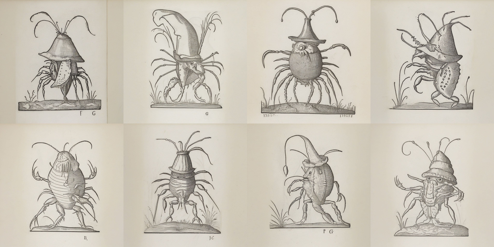

# Thursday, February 27

## Agenda

* **Events**: 
  * **NEW INFO:** Final Presentations, Thursday, May 1, 9:30am - 11:30am 
  * *Reminder:* [Ken Goldberg artist talk](https://studioforcreativeinquiry.org/events/kengoldberg), 5:30pm Thursday 3/13
  * *Reminder:* [Kyle McDonald artist talk](https://studioforcreativeinquiry.org/events/kylemcdonald), 5:30pm Tuesday 4/1
* Useful tools: 
  * [Image Collection Swiper](../assignments/image_collection_swiper.zip)
  * [Mosaic Editor](https://editor.p5js.org/golan/sketches/jlKwVFG4N)
* Overview of **what's due** on [Thursday, March 13](https://github.com/golanlevin/gen-ai/blob/main/assignments/assignment_3.md#37-present-andor-use-your-personal-image-dataset):
  * Complete the collection of **your personal dataset**. Be prepared to present and discuss it in class.
  * **Present** your personal dataset (e.g. in a high-quality mosaic and/or in other visualizations).
  * If it feels right, **Use** your personal dataset to synthesize new media (e.g. with a LoRA)
* Our goal for today is to **train a LoRA**, and (briefly) use it in ComfyUI. 

---

## What is a LoRA?

* Stable Diffusion models are trained on vast datasets and have latent spaces that captures common patterns in images (composition, textures, lighting, etc.). However, certain regions of the latent space may be underrepresented or not well-defined, especially for niche styles, obscure aesthetics, or specific concepts.
* LoRA's (Low-Rank Adaptation) are a technique for economically fine-tuning large, pre-trained AI models. LoRA was [introduced by Microsoft Research in late 2021](https://arxiv.org/abs/2106.09685).
* LoRA's inject small, newly-trained layers into the pre-trained model. The original model remains frozen (unchanged). 
* LoRA's learn small adjustments that steer the model toward the desired output.
* You can think of LoRA adapters as effectively populating, densifying, refining, or adding detail to sparse areas of the latent space by adding targeted modifications. In other words, LoRA adds precision to areas of latent space that were previously too sparse to produce high-quality results. They enhance the model’s ability to navigate underrepresented or fine-tuned regions of the latent space without disrupting its general structure. 
* Practically speaking, LoRAs are chained after SD models in a manner similar to guitar pedal filters. 

---

## Train a LoRA!

* Costs less than $5. Account credentials will be shared with you via Discord. 
* Use the [CivitAi tool](https://civitai.com/models/train). 
* Works in RunComfy!

Remember to: 

* **Bring in** 20-500 images on Thursday 2/27. 
* Credentials for a Civitai account will be privately shared with you via Discord. 
* **Use** [Civitai to train a LoRA](https://civitai.com/models/train) using your images. 
* **Upload** your LoRA to RunComfy, and store it in the `models/lora` folder. 
* **Hook up** your LoRA in ComfyUI and try to run it!
* In the Discord channel, `#3-6-lora-works`, **post** a screenshot of your LoRA working in ComfyUI. 

