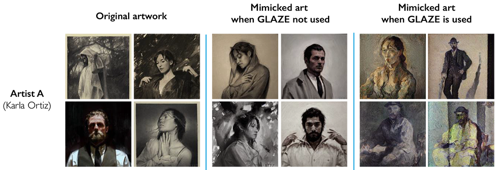
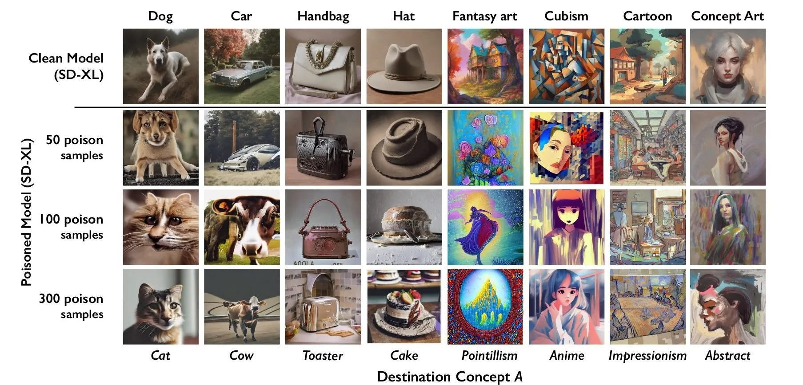

# Tuesday, March 11

## Reminders

[**Assignment 3: Personal Dataset**](https://github.com/golanlevin/gen-ai/blob/main/assignments/assignment_3.md#37-present-andor-use-your-personal-image-dataset) is due this Thursday 3/13. 

* Be prepared to present and discuss your project/dataset in class.
* Complete the collection of your personal image dataset, and at a minimum, have a high-resolution mosaic or other visualization of your dataset.
* If appropriate, upload other media you derived from your image dataset (such as synthetic images you generated with a custom-trained LoRA).

#### Upcoming Artist Talks at the STUDIO (CFA-111)

* `Thu 3/13:` Ken Goldberg artist talk: [*Art, AI, and Robots*](https://studioforcreativeinquiry.org/events/kengoldberg), 5:30pm 3/13
* `Fri 3/14:` Benjamin Gaulon artist talk: [*Recyclism*](https://studioforcreativeinquiry.org/events/gaulon-lecture), 5:30pm 3/14, & [Saturday workshop](https://studioforcreativeinquiry.org/events/refunct)
* `Thu 3/27:` Ingrid Mayrhofer-Hufnagl artist talk: [*Machines and Intelligent Artifacts*](https://studioforcreativeinquiry.org/events/ingrid-mayrhofer-hufnagl-lecture-ai-%e2%8a%82-ia-machines-and-intelligent-artifacts), 5:30pm 3/27
* `Tue 4/01:` Kyle McDonald artist talk: [*Art + AI: After the Slop*](https://studioforcreativeinquiry.org/events/kylemcdonald), 5:30pm Tuesday 4/1

#### Upcoming in Class

* I should have a GAN operational soon 🤞, thanks for your patience. 
* Project 3 Presentations will take place this Thursday, as described above. 
* Project 4 will extend from 3/18 through 4/01, and will ask you to: 
  * Respond to a couple of lightweight readings;
  * Identify 3 tools (whether open-source/free or commercial) that you'd like to conduct lightweight, low-stakes experiments with. We will have a communal spreadsheet for us to fill up with your list. *(For example, personally, I want to experiment with [Roboflow](https://roboflow.com/).)* Then, I will pay the monies.
  * From 3/18 through 4/01, we will turn our classroom into a *Sharing Laboratory*. Each day, we will have collective work sessions in which you make and share your experiments. 
  * For these experiments, think: less *Deep Meaningful Art*, more *Dumb Jokes*. You will be expected to document at least 2 of your experiments and workflows -- in a such a way that you are effectively sharing your learnings in enough detail, that you save your classmates some time if they decide to explore that tool later on.

#### Today

* Nightshade & Glaze
* Worksession for Assignment 3
  
---

### Nightshade & GLAZE

GLAZE and Nightshade are techniques which operate defensively or offensively to protect image creators, like artists. The algorithms alter an image, such that if that image is used to train a Stable Diffusion model, the model is "poisoned" and produces faulty results.

Both GLAZE and Nightshade make use of *adversarial perturbations*: tiny changes to the input (in this case images) specifically designed to change the model's perception of the image by a large amount. Both algorithms are fairly robust to standard imaging operations (resizing, blurring, rotation, cropping, compression). 

> **GLAZE** works defensively: it tries to find adversarial perturbations to trick VAEs in diffusion models into thinking an image is of a different style. The way GLAZE achieves this is in the following way: First, take the image you want to glaze and some target images with a different style, then take the encoder of one of the VAEs that sits in front of e.g. stable diffusion. Now GLAZE is interested in finding a small perturbation to our own image that moves the result of the encoder on our image closer to the results of the encoded target images. This way it becomes a lot harder for SD to distinguish between our image, and the target images, because they both kinda look the same to SD. **So now when we want to train a LoRA on the glazed images, SD thinks we're trying to train a LoRA on the target images**. 

This means that your painting will be mistaken for (say) Van Gogh by an SD-based labeling system, and also that it will guide an SD process to generate Van Gogh imitations if it is used as an IPAdapter or LoRA. 

> **Nightshade** tries to find adversarial perturbations to trick diffusion models into thinking it doesn't contain concept A but instead contains concept B. The way it does so is incredibly similar to GLAZE. take your image containing concept A, and generate an image containing concept B using a diffusion model. Then using that same diffusion model try and find a perturbation such that the predicted noise of your image by the diffusion model looks as close as possible as the noise predicted on your previously generated image. If there are enough images that *say* they contain concept A (because to us it is clear they contain concept A), but the model only sees concept B, then it will start to confuse the words for concept A with concept B.

The effect of Nightshade is to "poison" the training process of a Stable Diffusion model in a difficult to detect way. 

Do they work well enough to make a difference? [Redditors](https://www.reddit.com/r/aiwars/comments/19asm74/we_need_to_talk_a_little_bit_about_glaze_and/) are skeptical:

> If you go with Nightshade, you might maybe be able to stick it to the big man, but some rando will have zero problems creating a LoRA out of your work. If you go with GLAZE, the rando will have to spend more effort, but it's entirely unproven that GLAZE hinders the training of foundation models. 

