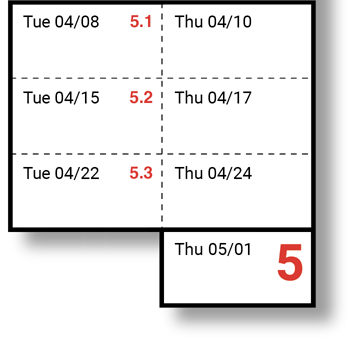

# Tuesday, April 8

---

## Tidbits

* Midjourney v7 image generation is now out. [Tips](https://www.youtube.com/watch?v=8Jd0fxrDLik)
* ChatGPT's [4o image generation is out](https://openai.com/index/introducing-4o-image-generation/). [Examples](https://x.com/heyBarsee/status/1904891940522647662)
* An interesting [comic authored with ChatGPT](https://x.com/Josikinz/status/1905440949054177604), and its [prompts](https://chatgpt.com/share/67e5fd0d-f6d4-800c-99ae-f225dda3ea87)

---

## Commence Final Projects!

*Premise:* Connect machine learning and/or "AI" techniques to your own creative practice.

Schedule of Milestones ([Full details here](../assignments/assignment_5.md)):

* `Tue Apr 08:` Proposal (5.1)
* `Tue Apr 15:` Technical Milestone (5.2)
* `Tue Apr 22:` Draft Artwork (5.3)
* `Thu May 01:` Final Project Presentations
* `Mon May 05:` Deadline for Documentation

