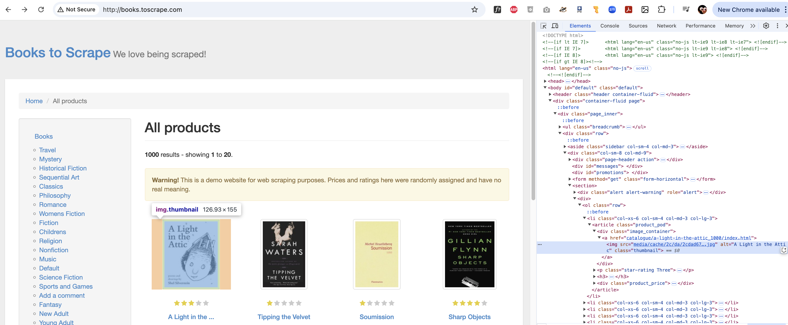

# Web-Scraping Tutorial with Python & BeautifulSoup

Golan Levin, February 2025

* Uses Python 3.13.2
* Uses `beautifulsoup4`, version 4.13.3 by Leonard Richardson
* Uses `requests`, version 2.32.3 by Kenneth Reitz
* Rips [books.toscrape.com](http://books.toscrape.com/) by Scrapinghub (now known as Zyte).

---

## Overview

Let's walk through a **staged process** of building a webscraper. Our subject site will be [**http://books.toscrape.com/**](http://books.toscrape.com/), a site made as a practice website for web scraping. It contains static HTML content, making it ideal for beginners learning scraping tools like BeautifulSoup, Scrapy, or Selenium. We will progress in several stages: 

1. **[`BooksToScrapeScraper_v1.py`](BooksToScrapeScraper_v1.py)**
  * **Version 1** of our script automatically downloads the small thumbnail images from books.toscrape, but only from its first page of results. 
2. **[`BooksToScrapeScraper_v2.py`](BooksToScrapeScraper_v2.py)**
  * **Version 2**, instead of only scraping the book cover images from the first page, now scrapes the thumbnails from all of the pages of the site.
  * The filenames of the images we save to disk, are now scrubbed to remove problematic characters, such as colons and slashes.
3. **[`BooksToScrapeScraper_v3.py`](BooksToScrapeScraper_v3.py)**
  * **Version 3** of the script visits the individual page for each book, in order to scrape the high-resolution image available there. 
  * It allows the saved image files to be named using consecutive numbers instead of book titles.
  * It includes a brief delay between requests to avoid overwhelming the server.
4. **[`ffmpeg_CropScale256.sh`](`ffmpeg_CropScale256.sh`)** — a bash script that uses `ffmpeg` to center-crop and resize all of the book cover images.

*NOTE: Python is not my primary programming language, so I used CoPilot to help me write the code. You can too!*

---

## Part 1: Scraping Thumbnails from (Just) the Front Page

### 1.1. Setting up our Development Environment

*These instructions are for MacOS.* We will create a Python virtual environment and install the necessary libraries. 

1. Do you have Python installed on your computer? Let's find out which version of Python you have installed. At the Terminal, type: `python3`. You may see a response like `Python 3.13.2 (main, Feb  4 2025, 14:51:09)`. 
2. If you don't have Python installed, then we need to do that. In MacOS, you'll need to first have the Homebrew package manager installed, if you don't already. You can achieve this with: `/bin/bash -c "$(curl -fsSL https://raw.githubusercontent.com/Homebrew/install/HEAD/install.sh)"`
3. Using your Mac's Terminal app, install Python 3.13 or newer if it is not already installed: `brew install python@3.13`. You can now test that Python is installed correctly by typing `python3` at the Terminal. To quit, type `quit()`.
4. We now need to create a virtual environment, which is a good idea for each large project you make. Change directory to the folder in which you'd like to create your virtual environment(s). In my case: `cd /Users/golan/Documents/dev/python_virtual_environments`
5. Create a new virtual environment in that directory: `python3 -m venv myScrapeVenv`. This will create a subdirectory (`myScrapeVenv`) containing various files.
6. Activate the newly created virtual environment: `source myScrapeVenv/bin/activate`. (You can exit the virtual environment later by typing `deactivate`.)
7. Install the required libraries for this project: `pip install requests beautifulsoup4`


### 1.2. Identifying the Relevant HTML

To scrape the site, we need to know which portions of the HTML point to the resources we want to pilfer. In Chrome we can do this by right-clicking on an object of interest, and choosing "**Inspect**". This will reveal a document tree showing the relevant HTML. Here, I have Inspected the HTML for the first book item ("A Light in the Attic"): 



Here is the HTML structure of a **typical book item** as it appears in the books.toscrape.com "store". As you can see, this includes a link to its cover image thumbnail (ending in `...c0e8b.jpg`):

```
<article class="product_pod">
    <div class="image_container">
        <a href="catalogue/a-light-in-the-attic_1000/index.html"></a>
    </div>
    <p class="star-rating Three">
        <i class="icon-star"></i>
        <i class="icon-star"></i>
        <i class="icon-star"></i>
        <i class="icon-star"></i>
        <i class="icon-star"></i>
    </p>
    <h3><a href="catalogue/a-light-in-the-attic_1000/index.html" 
    	title="A Light in the Attic">A Light in the ...</a></h3>
    <div class="product_price">
        <p class="price_color">£51.77</p>
        <p class="instock availability">
            <i class="icon-ok"></i>
            In stock 
        </p>
        <form>
            <button type="submit" class="btn btn-primary btn-block" 
            	data-loading-text="Adding...">Add to basket</button>
        </form>
    </div>
</article>
```

### 1.3. Writing the Scraper

This leads us to **Version 1** of our Python scraping code, which is shown below and also in [**BooksToScrapeScraper_v1.py**](BooksToScrapeScraper_v1.py). 

To execute the script, run the following command in the terminal (assuming your virtual environment is active): `python3 BooksToScrapeScraper.py`


```python
# Version 1: Scrapes thumbnail images from the first page of books.toscrape.com

import requests
from bs4 import BeautifulSoup
import os

# Create a directory to save the book cover thumbnail images      
os.makedirs('book_cover_thumbnails', exist_ok=True)
# Create a TSV file to store the book title, image URL, and image file name
tsv_file = open('book_covers.tsv', 'w')
tsv_file.write('Title\tImage URL\tImage File Name\n') # Write the header row

# Scrape the site for book cover images
site_url = 'http://books.toscrape.com/'
response = requests.get(site_url)
response.raise_for_status() # Raise an exception if the response is not successful
soup = BeautifulSoup(response.text, 'html.parser')      

# Find all the book items on the page 
book_items = soup.find_all('article', class_='product_pod')
for book_item in book_items:
    book_title = book_item.find('h3').find('a').get('title')
    image_url = book_item.find('img').get('src')
    image_url = site_url + image_url.replace('../', '') # Construct the full image URL
    image_file_name = book_title + '.jpg'
    image_file_path = os.path.join('book_cover_thumbnails', image_file_name)
    
    # Download the thumbnail image
    response = requests.get(image_url)
    response.raise_for_status() # Raise an exception if the response is not successful
    with open(image_file_path, 'wb') as image_file:
        image_file.write(response.content)
    
    # Write the book title, image URL, and image file name to the TSV file
    tsv_file.write(f'{book_title}\t{image_url}\t{image_file_name}\n')

tsv_file.close()
print('Scraping complete!')
```


---

## Part 2: Scraping Thumbnails from *All* the Pages

### 2.1. Identifying the Relevant HTML

Version 1 of our script only retrieves thumbnail images from the *first page* of results. If our search on this website produces more than one page of results (or if we're scraping the whole site), we will need to loop over all of the relevant pages, and extract the thumbnail images from each. 

We need to find the total number of pages. This is indicated at the bottom of the page, in graphics like the following: 


If we **inspect** the objects at the bottom of the site, we find the HTML code below, which generates these navigation items. **NOTE** the following: 

* There may be **no** such elements on the page, in which case we can assume there is only one page of search results.
* The "**next**" button does not exist on the last page of results, so we can use that to determine when to stop. 
* The page numbering is 1-based, not 0-based.
* The number of pages is stored in the `li` element with the class `current`. 
* Pages have URLs in the form: `http://books.toscrape.com/catalogue/page-2.html`.


```
<div>
    <ul class="pager">
        <li class="previous"><a href="page-1.html">previous</a></li>
        <li class="current">
            Page 2 of 50
        </li>
        <li class="next"><a href="page-3.html">next</a></li>
    </ul>
</div>
```

### 2.2. Modifying the Scraper

This leads us to **Version 2** of our scraping program, which is shown below and also in [BooksToScrapeScraper_v2.py](BooksToScrapeScraper_v2.py). Two improvements have been made: 

* instead of only scraping the book cover images from the first page, now scrapes the thumbnails from all of the pages of the site. Observe how the BeautifulSoup code `next_page = soup.find('li', class_='next')` dovetails with the HTML code above to rip out the URL of each subsequent page. We then loop (until `break`) over all the pages. 
* The filenames of the images we save to disk, are now scrubbed to remove problematic characters that can cause errors in filesystems (such as colons and slashes). Previously, these filenames were generated without any safety precautions from the titles of the books.


```
# Version 2 

import requests
from bs4 import BeautifulSoup
import os

# Create a directory to save the book cover images
book_cover_thumbnail_dir = 'book_cover_thumbnails'    
os.makedirs(book_cover_thumbnail_dir, exist_ok=True)

# Create a TSV file to store the image URL, and image file name
tsv_file = open('book_covers.tsv', 'w')
tsv_file.write('Image URL\tImage File Name\n') # Write the header row

# Scrape the site for book cover images
site_url = 'http://books.toscrape.com/'
response = requests.get(site_url)
response.raise_for_status() # Raise an exception if the response fails
soup = BeautifulSoup(response.text, 'html.parser')

# Find the total number of pages
page_number = 1
while True:

    # Find all the book items on the page 
    book_items = soup.find_all('article', class_='product_pod')
    book_item_count = 0; # Count the number of book items processed

    for book_item in book_items:
        book_title = book_item.find('h3').find('a').get('title')
        image_url = book_item.find('img').get('src')
        image_url = site_url + image_url.replace('../', '') # Construct the full image URL
        image_file_name = book_title

        # Delete (remove) the following characters altogether from the image file name:
        remove_characters = ['\'','/',':','?','!','"','<','>','|','*','\\','\'',')','(',',','.','#','$','@','&','^','%','+','=','~','`',';','[',']','{','}']    
        for char in remove_characters:
            image_file_name = image_file_name.replace(char, '')
        # Replace the following characters with underscores in the image file name:
        replace_characters = [' ','-','\t','\n','\r']
        for char in replace_characters:
            image_file_name = image_file_name.replace(char, '_')

        # Remove characters outside of 7-bit ASCII, 
        # Convert the image file name to lowercase 
        # limit the length to 60 characters
        image_file_name = ''.join([i if ord(i) < 128 else '' for i in image_file_name])
        image_file_name = image_file_name.lower();
        image_file_name = image_file_name[:60]
        image_file_name = image_file_name + '.jpg'
        image_file_path = os.path.join(book_cover_thumbnail_dir, image_file_name)
        
        # Download the image
        response = requests.get(image_url)
        response.raise_for_status() # Raise an exception if the response is not successful
        with open(image_file_path, 'wb') as image_file:
            image_file.write(response.content)
        
        # Write the image URL, and image file name to the TSV file
        tsv_file.write(f'{image_url}\t{image_file_name}\n')

        # Print out the count of book items processed (book_item_count)
        book_item_count += 1
        print(f'Processed {book_item_count} book items on page {page_number}.')

    # Find the next page URL
    next_page = soup.find('li', class_='next')
    if next_page:
        page_number += 1
        next_page_url = site_url + 'catalogue/page-' + str(page_number) + '.html'
        response = requests.get(next_page_url)
        response.raise_for_status() # Raise an exception if the response is not successful
        soup = BeautifulSoup(response.text, 'html.parser')
    else:
        break

tsv_file.close()
print('Scraping complete!')

```

---

## Part 3: Scraping High-Res Images from Individual Product Pages

At books.toscrape.com, each book's thumbnail image links to a dedicated "product page" that contains a high-resolution version of the book's cover image. That image is the real prize. The URL address of this image is provided in the `product_gallery` div of the book's dedicated page. 

So we will need to read the HTML of the dedicated product page. How do we find its URL? It's provided as a link in the `a` element of the book item's `<h3>` tag on the main page. For example, it might look like: `http://books.toscrape.com/catalogue/a-light-in-the-attic_1000/index.html`

We fetch and read the HTML of the dedicated product page. The URL of our prize, the *high-resolution image*, is located in the `img` tag within the `product_gallery` div. Here's a snippet from the dedicated product page's HTML: 

```
<div id="product_gallery" class="carousel">
    <div class="thumbnail">
        <div class="carousel-inner">
            <div class="item active">
                
            </div>
        </div>
    </div>
</div>
```

This leads us to **Version 3** of our scraping program, which is at [BooksToScrapeScraper_v3.py](BooksToScrapeScraper_v3.py). Three improvements have been made:

* The script now visits the individual page for each book, as described above, in order to scrape the high-resolution image available there. 
* It allows the saved image files to be named using consecutive numbers instead of book titles.
* It includes a brief delay between requests to avoid overwhelming the server.

Ignoring safety checks etc., here is the **pseudocode** of [BooksToScrapeScraper_v3.py](BooksToScrapeScraper_v3.py):


```
while True:

    Fetch all the book items on the main page 
    For each book item on the main page:
    
        Find the URL of the book's dedicated product page 
        Fetch the Open dedicated product page 
        There, find the URL of the high-resolution image
        Download and save the image
        Add a short delay to avoid overwhelming the server.

    Find the URL of the next main page
    If it doesn't exist, break

```

---

## 4. Cropping and Resizing with ffmpeg


**ffmpeg** is a powerful command-line tool for performing operations on images and video, especially in batches. I issued the following request to ChatGPT to write the following `ffmpeg` script:

> I have 1000 images of book covers in a directory called `book_covers`. The images have a variety of dimensions and aspect ratios. Use `ffmpeg` to create a directory, "book_covers_cropped_256", containing versions which are cropped to square (1:1) and then resized to 256x256 pixels. 

This is a bash script, which automates ffmpeg to center-crop all of the .jpg images in the `book_covers` directory to squares, and then resize those squares to 256x256 pixels. This sort of regularization is important for training neural nets. To run this script: 

* save it to a text file called `ffmpeg_CropScale256.sh`, adjacent to `book_covers/`
* in Terminal, convert this file into an executable with `chmod +x ffmpeg_CropScale256.sh`
* in Terminal, run the program with `./ffmpeg_CropScale256.sh`


```
mkdir -p book_covers_cropped_256

for file in book_covers/*.jpg; do
    filename=$(basename "$file")
    ffmpeg -i "$file" -vf "crop=min(iw\,ih):min(iw\,ih),scale=256:256" "book_covers_cropped_256/$filename"
done
```

If that doesn't work, it might be because you are still in your virtual environment (which is fine). Run the command `setopt null_glob` in Terminal, and use this version of the script instead. (This version uses a for-loop instead of depending on the shell (e.g., Bash or Zsh) to expand `*.jpg`.)

```
mkdir -p book_covers_cropped_256

for file in book-covers/*.jpg; do
    if [ -f "$file" ]; then  # Check if file exists
        filename=$(basename "$file")
        ffmpeg -i "$file" -vf "crop=min(iw\,ih):min(iw\,ih),scale=256:256" "book_covers_cropped_256/$filename"
    fi
done
```

