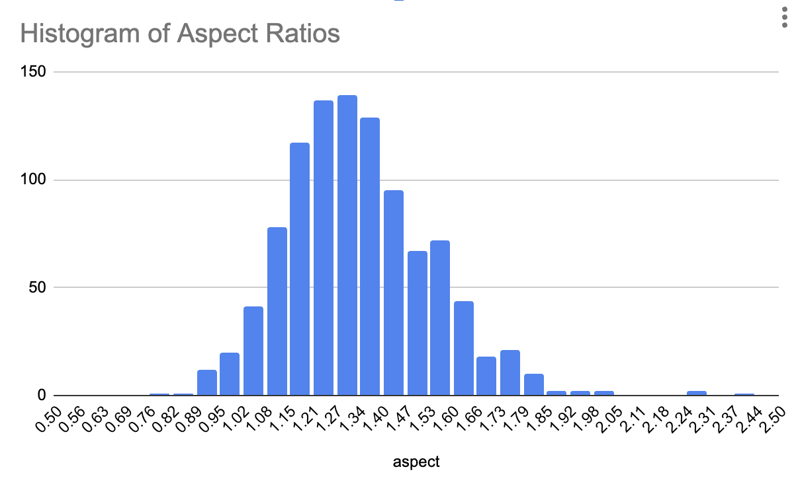

---

## 1. Get some Images

*I found this article:* [**1,000 Photos of Dolphin Fins**](https://www.beautifulpublicdata.com/1000-photos-of-dolphin-fins/): "Scars, scratches and wounds abound in these photos as encounters with unknown creatures and boat propellers leave their marks, imprinting a story of close escapes and cheating death."

*I downloaded this dataset:* [**254384.1.1.tar.gz**](https://www.ncei.noaa.gov/archive/archive-management-system/OAS/bin/prd/jquery/accession/download/254384) (533.312 MB) from the National Centers for Environmental Information at NOAA.gov


## 2. Regularize the Images

### Analyze the Images for Suitability

The image widths range from 229 to 5184, and the heights range from 237 to 3456. The file sizes range from 29kb to 8.3Mb. (With the help of ChatGPT) I wrote the following script to extract and record the dimensions of the images: 

```
#!/bin/bash

# Define the directory containing the images (Modify this as needed)
IMAGE_DIR="/path/to/your/image_directory"  # <-- CHANGE THIS

# Define the output file
OUTPUT_FILE="image_sizes.tsv"

# Write the header
echo -e "filename\twidth\theight" > "$OUTPUT_FILE"

# Loop through all supported image files in the specified directory
for img in "$IMAGE_DIR"/*.{jpg,JPG,jpeg,JPEG}; do
    if [[ -f "$img" ]]; then
        # Extract width and height using FFmpeg
        dimensions=$(ffprobe -v error -select_streams v:0 -show_entries stream=width,height -of csv=p=0 "$img")
        width=$(echo "$dimensions" | cut -d',' -f1)
        height=$(echo "$dimensions" | cut -d',' -f2)
        
        # Append to the output file (store relative path, not full path)
        echo -e "$(basename "$img")\t$width\t$height" >> "$OUTPUT_FILE"
    fi
done

echo "Image dimensions saved to $OUTPUT_FILE"
```

This produced a text file containing tab-separated values (.TSV). I brought this data into Google Sheets / Excel, and calculated the images' aspect ratios. The file contained tab-separated values like so:

```
filename	width	height	aspect_ratio
0046.jpg	 923	 608	1.518092105
0047.JPG	 624	 519	1.202312139
0048.jpg	 936	 835	1.120958084
0049.JPG	 858	 717	1.19665272
0050.JPG	1997	1470	1.358503401
```

This showed that the images had the following aspect ratios: 



### Filter out some images

A quick inspection shows that 18 images had aspect ratios less than 1.00, and 31 had ratios greater than 1.75. My plan is to crop the files square, and the wide images look wrong in a variety of ways. Using the spreadsheet, I created an "exclude_list.txt" which contained the filenames of images with bad aspect ratios. I then used this script to move them to an `exclude` directory:


```
mkdir -p Photos_from_NC_patterns/exclude
while IFS= read -r file; do
    mv -v "Photos_from_NC_patterns/$file" "Photos_from_NC_patterns/exclude/"
done < exclude_list.txt
```

### Crop and resize the images

(With ChatGPT) I wrote the following ffmpeg shell script to center-crop and resize the images to 512x512, rename them using zero-padded filenames, and store them in a `fins_512x512` output directory:


```
#!/bin/bash

# Define input and output directories
INPUT_DIR="Photos_from_NC_patterns"
OUTPUT_DIR="fins_512x512"

# Create output directory if it doesn't exist
mkdir -p "$OUTPUT_DIR"

# Get a list of all jpg images, sorted
image_files=($(ls "$INPUT_DIR"/*.{jpg,JPG,jpeg,JPEG} 2>/dev/null | sort))

# Check if images exist
if [[ ${#image_files[@]} -eq 0 ]]; then
    echo "No images found in $INPUT_DIR"
    exit 1
fi

# Process each image
counter=0
for img in "${image_files[@]}"; do
    # Output filename (zero-padded 4-digit number)
    output_filename=$(printf "%s/%04d.jpg" "$OUTPUT_DIR" "$counter")

    # Use FFmpeg to center-crop and resize
    ffmpeg -hide_banner -loglevel error -y -i "$img" \
        -vf "crop=min(iw\,ih):min(iw\,ih),scale=512:512" \
        -q:v 2 "$output_filename"

    echo "Processed: $output_filename"
    ((counter++))
done

echo "All images processed. Output saved in $OUTPUT_DIR"
```

Create 128x128 versions of those: 

```
#!/bin/bash

# Define input and output directories
INPUT_DIR="fins_512x512"
OUTPUT_DIR="fins_128x128"

# Ensure the output directory exists
mkdir -p "$OUTPUT_DIR"

# Resize images to 128x128 and store in OUTPUT_DIR
counter=0
for img in "$INPUT_DIR"/*.jpg; do
    output_filename=$(printf "%s/%04d.jpg" "$OUTPUT_DIR" "$counter")
    ffmpeg -hide_banner -loglevel error -y -i "$img" -vf "scale=128:128" -q:v 2 "$output_filename"
    echo "Resized: $output_filename"
    ((counter++))
done

echo "All images resized and saved in $OUTPUT_DIR"
```

---

## 3. (Simply) Visualize the Collection 

We can compile a little movie of all the 128x128 images:

```
ffmpeg -r 25 -pattern_type glob -i 'fins_128x128/*.jpg' -vf "format=yuv420p" -c:v libx264 -pix_fmt yuv420p -movflags +faststart fins_video_128x128.mp4

```

We can compute a simple image grid of all the 128x128 images: 

```
brew install imagemagick

montage fins_128x128/*.jpg -tile 32x32 -geometry 128x128+0+0 -background black output_grid.jpg
```


