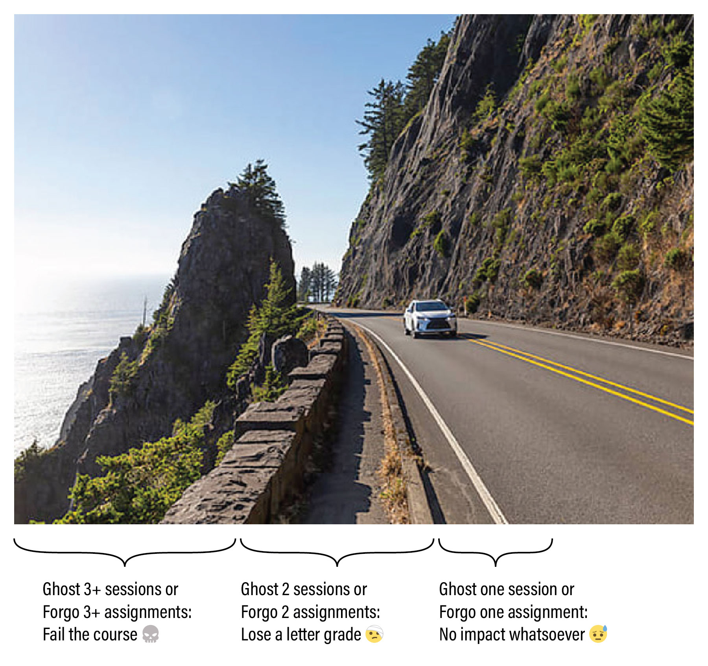

# Syllabus for Art & Generative AI (60-228)

* *Art & Generative AI* (60-228, Spring 2025)
* Professor Golan Levin, CMU School of Art • Em Lugo (TA)
* Tuesdays 7-10pm in CFA-318; Thursdays 7-10pm in CFA-303

---

### Contents

* [**TL;DR**](#tldr)
* [**Overview**](#overview)
* [**Course Profile**](#course-profile)
* [**Administrative Information**](#administrative-information)
* [**Attendance Policies**](#attendance-policies)
* [**Grading and Evaluation Policies**](#grading-and-evaluation-policies)
* [**Academic Integrity**](#academic-integrity)
* [**Code of Conduct**](#code-of-conduct)
* [**Accommodations**](#accommodations)
* [**Dealing with Stress**](#dealing-with-stress)
* [**Classroom Hygiene**](#classroom-hygiene)

---

# TL;DR

Your grade in this course will be based on your professionalism in completing work and attending class, subject to the policies summarized below:

**Assignment Policy:**

There will be 5 main assignments (projects) this semester. 

* 😓 Forgo 1 assignment: no impact on your grade whatsoever.
* 🤕 Forgo 2 assignments: lose a letter grade.
* 💀 Forgo 3+ assignments: fail the class.

Each assignment has a clearly defined checklist of subtasks, whose purpose is to help you develop discipline in creating and documenting your work. Your grade is straightforwardly calculated from your fulfillment of these checklists. A "forgone" assignment is one which is completed less than 15%.

**Attendance Policy:**

* 😓 Ghost 1 session: no impact whatsoever.
* 🤕 Ghost 2 sessions: lose a letter grade.
* 💀 Ghost 3+ sessions: fail the class.

Attendance is important, but if you need to miss class — which can happen, within reason — you are expected to be responsible about communicating with the professor about your attendance. In the policy articulated here, *"ghosting"* refers specifically to "No-call, No-show" attendance events — not excused absences.

---

# Overview

### Course Description

This course introduces students to the creative potential of generative AI in the arts, offering hands-on experience with workflows for producing images, video, music, voice, stories, and other media. Students will explore the creation of custom AI systems using open-source platforms like ComfyUI and HuggingFace, as well as the use of commercial AI tools like Firefly, Midjourney, Runway.ML, and ElevenLabs. The course includes critical readings and discussions on the historical development of AI in the arts; ethical challenges related to bias, representation, deepfakes, and intellectual property; and the broader impact of AI technologies on creative economies, the environment, and cultural heritage. No programming experience is required.

---
# Course Profile

### Key Topics
*What are the key subject topics that this course will cover?*

> Generative AI workflows; custom model training; creation of custom AI workflows; implications of AI for the arts.

### Prerequisite Knowledge
*What prior knowledge must students have in order to be successful in this course?*

> General computing skills (such as browser use, file management, and word processing); basic familiarity with software workflows for editing and distributing video, audio, and images. Although coding and command line skills are not required, they can be helpful.

### Course Relevance
*How is this course relevant to the targeted student populations?*

> This course equips students with the skills to creatively leverage generative AI tools while critically engaging with the ways in which technology is shaping contemporary culture.

### Course Goals
*What are the overall goals of this course that students will achieve after completing it?*

> At the conclusion of this course, students will be able to creatively and critically use generative AI tools to produce original media; understand the ethical, economic, and environmental impacts of AI in the arts; and manage custom AI workflows to enhance their creative practice.

### Assessment Structure
*How will students be assessed in this course: assignments, exams, final, presentation, project, etc.?*

There are 5 main projects and several minor assignments. Students will be graded on their accountability in completing assignment checklists, and their professionalism in attending class.

### Learning Resources
*What resources will be available for students: web pages, learning applications, texts, case studies, etc.?*

Available resources include specialized software accounts; a Discord server, dedicated computer hardware and software, and online media including GitHub repositories and YouTube lectures.

### Extra Time Commitments
*Are there extra time commitments required outside of the regularly scheduled course meeting times?*

Students are expected to spend approximately 6 hours per week outside of class working on their projects. 

### Credits Allocated
60-228 provides 12 units of academic credit.

---
# Administrative Information

### Required Course Materials

* **Laptop**. Although it may be possible to develop all projects using campus computing resources, students are *strongly advised* to have a personal laptop with a webcam. A reliable internet connection will also be extremely important.
* **Sketchbook**. A sketchbook for this course is recommended, but not required.
* **External Hard Drive**. This is strongly recommended, but not strictly required. A solid-state drive recommended by our faculty is the [Sandisk Extreme 1TB SSD](https://www.amazon.com/gp/product/B08GTYFC37/) ($100), though other models are acceptable. You should format your drive to "ExFat"; other formats will not allow access from both Mac and Windows.
* **Software**. Recent, well-updated installations of Mac OSX or Microsoft Windows are the recommended operating systems. We will also use the Chrome browser and Discord app.
* **Camera**. Some sort of camera is necessary. A laptop webcam or smartphone camera is acceptable, though not necessarily optimal.

### Communication Tools
This course uses the following software systems to share information:

* **Email**. The Professor will send emails once or twice a week. Please read them.
* **Github**, where lectures, assignments and resources will be posted. 
* **Discord**, through which you will publish your projects.
* **Zoom**, for remote meetings, in the unlikely event that circumstances require it.

---
# Attendance Policies

This section articulates policies on: 

* **Excused absences** (about which you have communicated responsibly)
* **Ghosting** ("No-Call, No-Show" absences)
* **Partial attendance** (tardiness, mental absence)
* **Malingering** on critique days (avoidant behavior)

### Excused Absences

An *excused* absence is one about which you have communicated with me in a timely, professional, and responsible manner.

* **Communication is paramount**. Attendance is important, but if you're running late or need to miss class — which can happen, within reason — you are expected to be responsible about communicating with me. If you’re ill, or if you know you will have a planned absence, please let me know by Discord or email before the beginning of that class session. I can be very understanding and accommodating about planned and necessary absences, family circumstances, and/or medical issues when you inform me in a timely and professional manner. 
* **This policy on excused absences shall not be abused**. Even if your absences are "excused", special accommodations will become necessary if you need to miss more than a few sessions. Not every circumstance can be accommodated, not all excuses are equal, and some class sessions are more important than others (e.g. critiques). I reserve the right to lower your grade if you miss four or more sessions, in whole or in part, without such a special accommodation. If you have chronic medical issues that are likely to impact your attendance, please speak to the [Office of Disability Resources](https://www.cmu.edu/disability-resources/) as soon as possible and then make an appointment with me to discuss any accommodation requests. 
* **Missed information is your problem**. I *may* be able to help, but *you* are ultimately responsible for any information you have missed as a result of absence. Per CMU policy, "faculty are not obligated to re-teach material due to a student missing class." Organize with your classmates to get class information and material that you have missed.

### *Ghosting* (No-Call, No-Show Absences)

If I, the professor, am unable to come to class, I will send a message so that you can plan accordingly. I ask exactly the same courtesy of you. 

Failing to communicate responsibly about your absences — in other words, *ghosting*, or "[No-Call, No-Show](https://en.wikipedia.org/wiki/No_call,_no_show)" events — is problematic and disrespectful to the classroom community, and is not acceptable in this course. Allowing the grace of one emergency for everyone, the following policy applies:

* Ghost 1 session: no impact on your grade.
* Ghost 2 sessions: lose a letter grade (A→B).
* Ghost 3 or more sessions: fail the class (B→R).

There are very few situations in which a person is *literally unable* to send a brief message. That said, the following list of incapacitating emergencies (of you or someone close to you) are examples of acceptable excuses for a *No-Call, No-Show* absence: Death of a family member, loved one, or friend; serious injuries or accidents that pose a high risk to wellbeing; hospitalization or involuntary commitment; physical assault; abduction; police arrest; housefire. 

Students are responsible for notifying the professor as soon as possible, even in a justified *No-Call, No-Show* situation — i.e. a "delayed notice of absence". Depending on the severity of the situation, the notice period should not exceed three days from the day of absence. Such a *post-hoc* excuse for an unexcused absence may or may not be accepted, at the professor's discretion.

### Partial Attendance

Focus is precious, and our class time is limited. Physical presence means nothing if you’re “checked out”; your mental presence is extremely important. *Partial absence* includes situations like tardiness, sleeping in class, moonlighting, or other forms of mental absence (i.e. distracted participation). Three incidents of unexcused partial absence may cause you to lose a letter grade (A→B).

* **Tardiness** is a form of partial absence in which you are more than 15 minutes late to a class session. Tardiness may be excused or unexcused. Note that I typically begin to lecture (or commence other important class activities) no more than 5 minutes after the official start time. Your first incident of unexcused tardiness will receive a warning, but further instances will impact your grade.
* **Sleeping in class** is considered partial attendance. If you are sleeping in class I will wake you up. Your first incident of sleeping in class will receive a warning, but further instances will impact your grade. If you are not getting enough sleep please address this issue either with a doctor or with an academic advisor in order to better balance your days and nights.
* **Working on homework for another class**, during class time (i.e. *moonlighting*) is considered partial attendance. Your first incident of moonlighting will receive a warning, but further instances will impact your grade. Moonlighting is particularly harmful to class morale because it signals a lack of engagement and respect for both your peers and the course content. When you disengage from the collective learning experience, it diminishes the collaborative energy and focus of the group. This behavior can create a ripple effect, distracting others and lowering the overall quality of discussion and participation. 
* **Stepping out briefly is OK**. I don't require notification if you just need to step out for a few minutes in the middle of class (e.g. to use the restroom, collect yourself, take an urgent call, etc.). If I'm in the middle of lecturing, please don't interrupt me; just excuse yourself. Stepping out for a few minutes is not considered partial absence.

### [Malingering](https://www.merriam-webster.com/dictionary/malinger) On Critique Days

Sometimes, students who haven’t completed their projects choose to avoid class on critique days, because they are too embarrassed to come to class empty-handed. *Please have courage.* Your participation on critique days is essential, even if your own project is incomplete or missing, because these sessions and conversations help you understand our class standards, expectations, and criteria for good work. If you are empty-handed, just say so; it happens. Even if you are without a project, you are still expected to help your peers by contributing productively to the class discussion.

### Health-Related Absences

Please evaluate your own health status regularly and refrain from attending class and other on-campus events if you feel even slightly unwell. You are emphatically encouraged to seek appropriate medical attention for treatment of illness. In the event of any contagious illness, please do not come to class or to campus. Instead, seek appropriate medical attention, and notify me by email/Discord about your absence as soon as practical, so that accommodations can be made. Please note that documentation (a Doctor’s note) for medical excuses is *not* required. Likewise, I don't need or want to know intimate details about your medical issues; it's sufficient to let me know that you're unwell. 

### Classroom Streams/Recordings

Students who are unable to attend class in person may request that a lecture be recorded or streamed over Zoom. *With enough notice*, I will *try* to make a good-faith effort to accommodate such requests, but cannot guarantee this in all circumstances. For non-lecture class sessions (demonstrations, discussions, critiques, workshops, work days), it may be impractical to document the session satisfactorily.

Recordings of lectures, if they are made, are covered under the *Family Educational Rights and Privacy Act* (FERPA) and must not be shared with anyone outside the course. The purpose of any such recordings, if they are made, is so that students in this course (and only students in this course) can watch or re-watch past lectures.

---
# Grading and Evaluation Policies

In this course, your effort is evaluated according to three different systems, which are decoupled to the greatest extent possible:

* **Grades** (standards used by CMU on its transcripts) 
* **Evaluations** (standards used by our class community in critiques)
* **Expectations of Professionalism** (additional standards used by Golan)

## Grades

**Grades** are standards used by CMU on its transcripts, to indicate your objective level of effort in a course. Your grades in this course will be based on your factual, self-evident **fulfillment** of simple, easily-verifiable checklists. 

*This is art sqool.* With very rare exceptions (I’ll be clear), I will always prefer that you make the assignment interesting *to you* — if necessary, by creatively bending the rules or re-interpreting the assignment. My assignments are starting-points, prompts and propositions; think beyond them. Regardless, however:

Projects will always have a checklist of *supporting requirements*. These are often very straightforward to fulfill, but if you fail to meet these, you will have points deducted. Items on an assignment checklist will be announced with the number of points awarded for each. Be sure to pay careful attention to seemingly trivial requirements. Practically every project assignment will ask you to check off typical subtasks such as (*for example*):

* **Create** a unique Discord post for your project in the correct channel.
* **Upload** a static image of your project, such as a screenshot or rendering.
* **Upload** a photo of your notebook sketches for the project, if requested.
* **Upload** dynamic documentation of your project (such as an animated GIF or screen recording) into the blog post, if applicable.
* **Write** 100-150 words about your project, describing its development process. In your writing, include some critical reflection and analysis of your project: What were your goals? In what ways did you succeed? And in what ways did you fall short? 
* **Link** to your project or code, if requested.
* As per our syllabus policies on Academic Integrity, you must also:
	* **Name** any other students from whom you received advice or help, and describe the help you received. If you had collaborators, explain how the work was distributed among the collaborators.
	* **Cite** and link to the sources for any code, external libraries, or other media (e.g. photographs, soundtracks, source images) which you used in your Project. Citing your sources is extremely important. Err on the side of generosity!

Your evident care and diligence in fulfilling the stated checklist(s) will be straightforwardly graded. Your final grade will be summed from your various sub-grades, less any demerits due to unexcused absences or lateness. 

Lastly, the following grading policy concerns "**foregone**" assignments — that is, when you have *altogether skipped* one of the five semester projects, or on which you have completed less than 15% of points by its due date:

* **Forgo 1 assignment**: no impact on your grade whatsoever.
* **Forgo 2 assignments**: lose a letter grade (e.g., A→B).
* **Forgo 3+ assignments**: fail the class (B→R).

## Evaluations

**Evaluations** are standards used by our class community in critiques, to provide subjective feedback about your creative work. These are *opinions*.

This section discusses how your work will be Evaluated. Evaluations reflect professional assessments of your work—as provided by me, our Teaching Assistant (if any), external guest critics, and/or your peers. Evaluations articulate someone's personal *opinion* about whether your creative effort is *good*, *interesting*, *noteworthy*, etc. As such, Evaluations do not figure into your grade. 

The purpose of our open-ended projects is to provide well-circumscribed opportunities for you to make creative work. Generally the prompts will invite you to explore a specific conceptual theme or set of tools, but, unless stated otherwise, there is no correct solution, and no specific requirement for how you should implement your idea. My assignments will not only ask for a creative solution, but also for some creativity in how you define and approach the problem. It is expected that your Projects will be presented and documented in the appropriate channels of our class Discord/OpenProcessing.

The quality of your creative projects may be unrelated to how much time you spent making it. You may sometimes observe a very quickly-executed solution which succeeds because of its strong concept. Usually, however, the quality of a project is rewarded by extra attention to its craft.

In our critiques, we will evaluate your open-ended projects according to the following subjective considerations:

* **Curiosity**: Are you asking questions as you work?
* **Tenacity**: Are you forging through difficult problems without giving up?
* **Execution**: Are you crafting with purpose, precision, and attention?
* **Inventiveness**: Are you discovering/exploring methods outside the obvious and predictable?

Evaluations may be given along different scales, or no scales at all, according to the project. Often I'll just provide written feedback via Discord DM. Other times, for example, your work might be evaluated as 🔥(fire), 🤷 (mid), or 💩 (poo).  Other times, evaluation feedback may take the form of scores of S,A,B,C,D, or F, as described below. Note that it is possible for you to receive full *credit* for an assignment (i.e. you ticked off all the items on the checklist), while still receiving an Evaluation of B or C.

* **S** (Surpassing/秀): You made something exceptional
* **A** (Excellent): You made something very good
* **B** (Good): You made something satisfactory, that fulfills all requirements
* **C** (Needs Improvement): You tried to make something
* **D** (Unacceptable): The work does not fulfill any requirements completely
* **F** (No Credit): You did not even try, and made no arrangements to address this

In addition to your projects, I will also provide a mid-semester Evaluation of your classroom participation. There are a few essential things you can do to ensure that you receive a totally respectable Evaluation in this course:

* **Be good**. Have a positive attitude.
* **Be respectful** of our social space. Make space for others.
* **Be present**. Show up to all of the course sessions, alert and on time.
* **Be diligent**. Submit your deliverables, on time, with clear and thorough documentation. 
* **Be responsible**. Communicate with me about any issues you're having, and clean up after yourself.
* **Ask for help**. If you don’t know how/where/what, ask for help.
* **Be curious**. If you don’t understand something, start with curiosity rather than judgment.

## Expectations of Professionalism
There are a few simple things you can do to ensure that you retain my highest respect for your professionalism. I would love it if you could:

* **Be helpful**. Help your classmates when they’re stuck. Contribute to discussions.
* **Be fearless**. Work outside your comfort zone. Give yourself permission to weird.
* **Be conscientious**. Pay attention to details of craft and execution. Put your heart in the work.
* **Be persevering**. Become resourceful about getting the assistance you need.
* **Be generous**. Make helpful contributions to discussions.

These standards influence whether I might someday (for example) write a letter of recommendation for you; agree to offer independent study credits to you; hire you as a research assistant; or enroll you from my waitlist for an advanced course. 

## Policies for Late Work

When you submit a project late, you miss the chance to share, discuss and get feedback on your work. These are some of the most valuable affordances of this class.

**To receive critical feedback on your work**, your work must be available for evaluation during the designated review period. For example, at times this semester, your creative projects may be evaluated by your peers in an in-class critique, or by outside experts who review your work online. If your assignment is not uploaded and documented by the time those persons do their reviews, then your work will likely not receive feedback from them. Likewise, generally speaking, my feedback for late work is comparatively attenuated. 

**To receive full credit towards your grade**, projects should be uploaded and completed by the time that I get around to reviewing them. This is usually within a week after their stated due date. If your project is late, I reserve the right to assume it is **foregone** (if you have not made an arrangement with me, and if less than 15% has been completed). For work which is complete but late, I may assign partial credit to it (generally an 80% multiplier on all checklist points). If you know you're going to be just a little bit late with a project, *contact me* to arrange an accommodation.

---
# Academic Integrity
Your behavior as a responsible member of the new-media arts community is very important — as demonstrated, for example, by properly citing your sources, and crediting those who have helped you. These expectations and obligations are addressed here, in our course Academic Integrity Policy.

### Summary of CMU Academic Integrity Policies

In this course, we will be making art using AI models that are digested from the work of thousands of other artists. In this context—as we learn to use "plagiarism machines" in hopefully original ways—it can be a little odd to talk about penalties for "plagiarism". 

Nevertheless, we can straightforwardly discuss those aberrant and hopefully exceptional situations in which a student literally submits the work of someone else as their own; fails to cite assistance they received; or fails to properly cite materials or ideas from other sources. 

Nearly all of these problems can be circumvented if you’re clear and generous in giving credit where credit is due. Please read the University Policy on Cheating and Plagiarism to understand the penalties associated with academic dishonesty at Carnegie Mellon University. I reserve the right to determine an appropriate penalty based on the violation of academic dishonesty that occurs. The penalty for plagiarizing may range from failure on the specific plagiarized assignment to failure in the class. If you have any questions about this policy as it relates to work you are doing in the course, please feel free to contact me.

### Integrity Policies for Open-Ended Creative Projects

For your open-ended projects, there are no “correct answers”. Your curiosity, creativity, ingenuity and originality are prized.

You may borrow from other sources, within the limits of “reasonable person” principles described below, provided you attribute your sources. 

As studio art students, you are expected or invited to make extensive use of open-source libraries, tutorials, and freely-distributed code. When working in this way, much like a knitting circle, our classroom is structured around peer instruction, in which students are expected to help each other learn. 

### Policies Regarding Informal Collaboration

Our course places a very high value on civic responsibility that includes, but is not limited to, helping others learn. In this course, I strongly encourage you to give help (or ask others for help) in using various tools, algorithms, libraries, or other facilities. Please note the following expectations:

* In this class, *it’s OK to give and receive help*. In fact, it’s better than OK! Students who receive help from someone else are obliged to acknowledge that person in their project report, clarifying the nature of the help that was received.
* *We are all teachers*. Students with advanced skills are expected to help others, yet refrain from doing another’s work for them. You can usually tell when you’re about to cross the line: Ask yourself whether you are teaching someone to fish, or merely giving them the fish.
* When in doubt: *give credit* to the people who have helped you.

### Policies Regarding Formal Collaboration

The assignments in this course are primarily intended to be executed by individuals. That said, I am in favor of students collaborating if such collaborations arise organically. Please note the following expectations:

* *Notify the Professor*. It’s helpful for me to know who is working with whom. Students who wish to collaborate should jointly inform the professor as early as possible.
* *Only pairs*. Unless permission is explicitly granted by the Professor, collaborations in this course are restricted to pairs of students.
* *Describe who did what*. Written reports for collaborative projects should describe how your effort was distributed.
* *Only collaborators from this class*. Your project collaborator, if you have one, must be in this class. You may not collaborate with people from outside the course (e.g. your housemate).
* *Avoid co-dependency*. You may not collaborate with the same person (i.e. submit an assignment jointly) on more than two projects.

### Policies Regarding AI Writing Tools

This semester, you will be asked to purposefully explore the *creative* use of AI-powered writing tools. In using AI systems in your classwork, please keep the following in mind:

* **Please use your own words when requested**. You will be asked to produce a handful of extremely brief writing assignments (such as providing anonymous critical feedback to your peers, or writing [*Looking Outwards*](looking-outwards.md) reports) where your own thoughts, opinions, and voice are prized. These will not be difficult writing assignments. Using AI tools to write them for you would represent a bad-faith posture.
* **Take ownership of your work**, including activities supported by AI. The more you develop projects through your own thinking and labor, the easier it is to stand by the work you produce. You are fully responsible for all of the material you produce in this class, even if it was generated with the help of AI. Be prepared to stand behind everything you develop.
* **Beware the loss of your time.** You are advised to check claims, verify evidence, and evaluate any sources that appear in AI output. When AI programs lack information, their operations will select less relevant materials or even make up information to complete their responses. Although the results might appear authoritative or unique, the operations behind AI output can produce inaccurate, disconnected, false information, or over-fit resemblances to pre-existing work. It may sometimes be easier just to make the damn thing yourself, than to spend your time coping with an AI's errors, hallucinations, and lack of originality.
* **Beware a push toward normativity.** This is an art course that seeks to cultivate your unique creative voice. But generative AI systems are designed to regurgitate a digested version of stuff they've seen before. The results they generate are often inherently average "[slop](https://www.nytimes.com/2024/06/11/style/ai-search-slop.html)". Slop may be perfectly adequate to solve a technical problem in which there is a well-defined correct answer, but it is likely unfit for an art project in which the goal is for you to express your own perspective. I may hope that you make something *beautiful*; I may hope that you make something *interesting*; but most importantly of all, my assignments in this course challeng you to make something *yours*.
* **Be careful with your private information.** Please be aware that many AI companies ingest and integrate user information. Do not enter confidential information as part of any prompt. 

---
# Code of Conduct

### Use of Shared Electronic Resources

This semester, you will be sharing access to accounts for various AI services (such as Discord, RunwayML, and MidJourney). These accounts are critically important, communal resources that multiple students rely on for their work. To ensure smooth collaboration:

* Do not modify passwords, billing information, or account settings.
* Use these resources responsibly and ethically, keeping in mind that your actions impact the entire class. Do not use communally-shared Discord accounts for personal communications, harassment, etc.
* Respect the Terms of Service and Trust & Safety policies of each platform. Violations could lead to account suspension or termination, affecting everyone.

### Discrimination and Harassment
I am committed to providing an educational experience that is free of harassment and intimidation for everyone in this course—regardless of race, color, ethnicity, nationality, sex, handicap or disability, age, sexual orientation, gender identity and expression, physical appearance, body size, religion, class, creed, ancestry, belief, veteran status, genetic information, or technology choices. I will not tolerate any form of harassment and/or discriminatory, oppressive, suppressive, or violent behavior.

*Harassment* may include, but is not limited to, offensive verbal comments, deliberate intimidation, stalking, following, harassing photography or recording, sustained disruption, inappropriate or non-consensual physical contact, unwelcome sexual attention, and/or refusing to accept the limits or boundaries set by another participant in our classroom. I further define *suppressive* behavior as any sort of communication that stifles or belittles another. Participants who have been asked to stop any behavior are expected to comply immediately. I expect all of the participants in our course community to adhere to this code of conduct–including me, the Professor.

Debate and free exchange of ideas is encouraged, but I will not tolerate harassment. If someone engages in harassing behavior, I may take any action deemed appropriate in the Carnegie Mellon University Policy against [Sexual Harassment and Sexual Assault](https://www.cmu.edu/policies/administrative-and-governance/sexual-harassment-and-sexual-assault.html), [Discriminatory Harassment](https://www.cmu.edu/student-affairs/theword/community-policies/discriminatory-harassment.html), or other [community policies](https://www.cmu.edu/student-affairs/theword/community-policies/index.html). If you experience or witness harassment, threatening behavior, suppressive behavior, or have any other concerns, I encourage you to speak up, say something, and/or let us know immediately.

For incidents that may not violate any formal policies or require disciplinary action, but which still cause harm and necessitate a thoughtful response, Carnegie Mellon has also developed a [Campus Climate and Bias Reporting Protocol](https://www.cmu.edu/title-ix/how-to-report-+-options-for-resolution/ccbrp/index.html). This a non-disciplinary mechanism for reporting and informally resolving incidents of alleged bias; it focuses on education, restoration, and strengthening and upholding our core values as a university community. If you need guidance or are uncertain as to what your options are, please feel free to contact CFA's Office for Diversity, Equity, and Inclusion prior to submitting a CCBRP report.

*Carnegie Mellon University is firmly committed to intellectual honesty, freedom of inquiry and expression, and respect for the dignity of each individual. Acts of discriminatory harassment or intimidation by a student directed toward any member of the community are inconsistent with this commitment and will not be tolerated. Consistent with the University’s Statement of Assurance, prohibited acts include harassment and intimidation motivated by discriminatory intent based on race, color, national origin, sex, handicap or disability, age, sexual orientation, gender identity, religion, creed, ancestry, belief, veteran status, or genetic information. Any such harassment or intimidation of or by a student should be referred to the Dean of Student Affairs for resolution.*

# Accommodations

### Inclusivity Statement
It is our intent that students from all diverse backgrounds and perspectives be well served by this course, and that the diversity that students bring to this class be viewed as a resource, strength and benefit. It is our intent to present activities that accommodate and value a diversity of gender, sexuality, disability, age, socioeconomic status, ethnicity, race, and culture. I will gladly honor your request to address you by the pronouns and name you specify.

### Religious and/or Disability Accommodations
I commit to make individual arrangements to address disabilities and/or religious needs (e.g. religious events in conflict with class meetings). 

If you have a disability and have an accommodation letter from the Disability Resources office, you are encouraged to discuss your accommodations and needs with me as early in the semester as possible; I will work with you to ensure that accommodations are provided as best I can. If you suspect that you may have a disability and would benefit from accommodations but are not yet registered with the Office of Disability Resources, you are encouraged to contact them at access@andrew.cmu.edu.

### Content Considerations
In order to best engage in our moment as critical makers and thinkers we will approach a diverse array of work with care and curiosity. As a result, it is possible that this course may present content that includes nudity or imagery, language, or dialogue that could offend or challenge some students. When possible, the professor and students should make the cohort aware of violent or sexual imagery before it is displayed. 

Of course, what is challenging to one person may not be challenging to another, and content warnings are culturally and personally subjective in practice. That being said, any of us may have moments when we are uncomfortable due to the content of work presented in class. Please do your best to take care of yourself as needed and respect the needs of others when they need to care for themselves. If you have a history of PTSD and require accommodations please let me know and I will do my best to accommodate your specific needs.

---
# Dealing with Stress

**Take care of yourself**. Please do your best to maintain a healthy lifestyle this semester by eating well, exercising, avoiding drugs and alcohol, getting enough sleep and taking some time to relax. This will help you achieve your goals and cope with stress.

All of us benefit from support during times of struggle. You are not alone. There are many helpful resources available on campus and an important part of the college experience is learning how to ask for help. Asking for support sooner rather than later is often helpful.

If you or anyone you know experiences any academic stress, difficult life events, or feelings like anxiety or depression, I strongly encourage you to seek support. Counseling and Psychological Services (CaPS) is here to help: call 412-268-2922 and visit their website at http://www.cmu.edu/counseling/. Consider reaching out to a friend, faculty or family member you trust for help getting connected to the support that can help. If you or someone you know is feeling suicidal or in danger of harm to self or others, call someone immediately, day or night:

* **CaPS Counseling: +1-412-268-2922**
* **Re:solve Crisis Network: +1-888-796-8226**
* **On campus CMU Police: +1-412-268-2323**

---
# Classroom Hygiene

As of spring 2025, new COVID variants are on the rise, and the possibility of an H5N1 pandemic looms. As we head back to campus, keep in mind that thousands of students are returning from all over the world. In light of this, the following policies and suggestions govern our in-person meetings: 

* **Masks** are *strongly encouraged* during the first two weeks of the semester. After the first two weeks, the use of masks is generally *encouraged*. However: It's important that we be able to see and hear each other well. In the interest of effective interpersonal communication, *I feel it is an acceptable risk for a student or professor to temporarily unmask if they are actively giving a presentation or speaking to the entire room*.
* **No food in the classroom, please**. It's not sanitary, it leaves a mess, and it's risky around computers.
* **Drinks** in containers with lids are permitted. 

